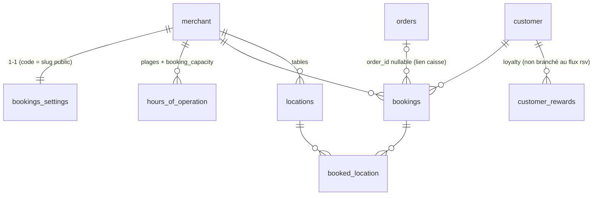

# Audit de l'existant — Module de réservation (`ib-welloresto-api`)

> **Date :** 2026-07-03
> **Périmètre :** lecture seule du repo `ib-welloresto-api` (branche `staging`), plus inspection des clients `wello-back-office`, `wello_resto_flutter` (POS), `wello-kiosk`, `wello-resto-scannorder`.
> **Référentiel de comparaison :** le document `cadrage-fonctionnel-reservation-welloresto.md` **n'a été trouvé nulle part sur le poste** (recherche dans tous les repos du workspace). La section 2 s'appuie donc sur les 7 piliers énoncés dans la commande d'audit (5.1 prise de réservation, 5.2 plan de salle, 5.3 anti no-show, 5.4 communication, 5.5 CRM, 5.6 pilotage, 5.7 acquisition). Les priorités MoSCoW indiquées sont des hypothèses à valider contre le cadrage réel.

**Constat structurant :** la réservation est éclatée en **deux modules distincts** qui coexistent :

- `internal/modules/bookings/` — API **staff/interne** (authentifiée), consommée par le POS ;
- `internal/modules/reservation/` — API **publique** (routes `/rsv/{slug}`, sans auth) pour la prise de réservation en ligne, portage direct d'un ancien code PHP (les commentaires y font référence explicitement : « anciennement dans la boucle PHP », « fallback comme PHP », « comme PHP »).

Les deux modules dupliquent le calcul de disponibilité avec des règles **différentes**, et le module public délègue accept/deny au module staff d'une manière qui ne peut pas fonctionner (voir §3.3).

---

## 1. Cartographie de l'existant

### 1.1 Inventaire des fichiers concernés

#### Migrations SQL

| Fichier | Contenu |
|---|---|
| `migrations/done/019_add_subscription_feature_flags.sql` | Ajoute `bookings_enabled TINYINT(1)` aux tables de souscription (feature flag d'accès au module) |

**Aucune migration ne crée les tables métier** (`bookings`, `booked_location`, `bookings_settings`, `hours_of_operation`, `locations`). Elles préexistent au repo Go — héritage du backend PHP. Le schéma n'est documenté nulle part dans le repo ; il est reconstitué ci-dessous (§1.2) à partir des requêtes SQL.

#### Modèles / structures Go

| Fichier | Structures | Remarque |
|---|---|---|
| `internal/modules/reservation/models.go` | `Merchant`, `OperationHour`, `OperationRange`, `Slot`, `BookingRequest`, `BookingData`, `CustomerData`, `Reward`, réponses | Modèles du flux public |
| `internal/modules/bookings/models.go` | `Booking`, `BookingObjectRequest`, `MerchantBookingParams`, `TimeRange`, `BookingSlot`, `Location`, `ExistingBooking` | Modèles du flux staff |
| `internal/models/bookings_models.go` | `models.Booking`, `models.BookingSlot` | 3ᵉ variante, utilisée par `locations` (plan de salle) |
| `internal/models/bookings_availability_models.go` | `models.BookingAvailabilityResponse`, `models.MerchantBookingParams`, `models.TimeRange` | Doublon quasi identique de `bookings/models.go` |

Quatre représentations d'une réservation coexistent (`reservation.BookingData`, `bookings.Booking`, `models.Booking`, plus le sous-ensemble embarqué dans `locations`). Dates tantôt `string` MySQL, tantôt `int64` Unix.

#### Repositories

| Fichier | Rôle |
|---|---|
| `internal/modules/reservation/repository.go` | Marchand par QR/slug, horaires, capacité réservée, insert booking, get/update/cancel par numéro. Contient du code mort (voir §1.3) |
| `internal/modules/bookings/repository.go` | CRUD booking staff, calcul de disponibilité, chargement des tables (`locations`) |
| `internal/modules/bookings/bookings_fetcher.go` | Requête de lecture composite (booking + client + marchand + tables) |
| `internal/modules/locations/repository.go` | Plan de salle : embarque les bookings `ACCEPTED` des ~5 dernières heures par table |
| `internal/modules/scannorder/repository.go` | `GetBooking` : retrouve le client d'une réservation en cours via le QR code de table |
| `internal/modules/order_life_cycle/repository.go` | `ClearBookings` (détache `order_id`), passage `status='0'` à la clôture de commande |
| `internal/modules/pos/repository.go` / `create_repository.go` | CRUD `hours_of_operation` (avec `booking_capacity`, `first/last_booking_time`), insert `bookings_settings` à la création du marchand |

#### Services

| Fichier | Rôle |
|---|---|
| `internal/modules/reservation/service.go` | Horaires d'ouverture, calcul de créneaux public, création (+auto-accept), lecture, modification (limite 3 séquences), annulation |
| `internal/modules/bookings/service.go` | Recherche, lecture, création staff (transactionnelle via `RunInTx`), accept, deny, disponibilité |

#### Handlers HTTP

| Fichier | Handlers |
|---|---|
| `internal/modules/reservation/handler.go` | `HandleGetOpenHours`, `HandleGetAvailability`, `HandleCreateReservation`, `HandleGetReservation`, `HandleUpdateReservation`, `HandleCancelReservation` |
| `internal/modules/bookings/handler.go` | `SearchBookings`, `GetBooking`, `CreateBooking`, `AcceptBooking`, `DenyBooking`, `GetBookingAvailability` |

#### Routes exposées (`cmd/api/routes.go`)

**Staff — `/bookings` (authMiddleware, pas de check RBAC) :**

| Méthode | Path | Description |
|---|---|---|
| POST | `/bookings/` | Recherche (par id, numéro, plage de dates) |
| GET | `/bookings/availability/{date}` | Disponibilité + occupation + tables pour une date |
| POST | `/bookings/create` | Création par le staff |
| GET | `/bookings/{booking_id}` | Détail |
| PATCH | `/bookings/{booking_id}/accept` | Acceptation |
| PATCH | `/bookings/{booking_id}/deny` | Refus |

**Public — `/rsv/{slug}` (aucun middleware : ni auth, ni rate-limit) :**

| Méthode | Path | Description |
|---|---|---|
| GET | `/rsv/{slug}/open-hours` | Fiche marchand + horaires formatés (jours en français en dur) |
| GET | `/rsv/{slug}/booking-availability?date=&party_size=` | Créneaux disponibles (date en timestamp Unix) |
| POST | `/rsv/{slug}/booking/create` | Création de réservation client |
| GET | `/rsv/{slug}/booking/{booking_id}?number=` | Lecture par numéro (le path param est ignoré, seul `?number=` compte) |
| POST | `/rsv/{slug}/booking/{booking_id}/update` | Modification |
| DELETE | `/rsv/{slug}/booking/{booking_id}/cancel?number=` | Annulation (path param ignoré aussi) |

#### Middlewares spécifiques

Aucun. `/bookings` n'applique que `authMiddleware` — **aucun `RequirePermission`** alors que le reste de l'API utilise le RBAC (`internal/middleware/permissions.go` ne contient aucun helper booking). `/rsv` est totalement public.

#### Jobs / tâches asynchrones

| Fichier | État |
|---|---|
| `internal/tasks/notifications.go` → `SendBookingReminders()` | **Stub vide** (deux `TODO`, deux `log.Println`) |
| `cmd/api/tasks.go` | Câblé `@every 15m`, mais tout `SetupTasks` est désactivé par un `return` en tête de fonction |
| `internal/tasks/manager.go` | `BookingService` injecté dans le `TasksManager` mais jamais utilisé |

Aucun événement WebSocket ni FCM pour les réservations (zéro occurrence de booking dans `internal/infrastructure/`).

#### Tests

**Aucun test** dans `reservation/` ni `bookings/` (aucun `*_test.go`).

---

### 1.2 Modèle de données actuel

Schéma **reconstitué depuis les requêtes** (pas de DDL dans le repo) :

**`bookings`**

| Colonne | Type inféré | Remarques |
|---|---|---|
| `booking_id` | INT AUTO_INCREMENT PK | |
| `booking_number` | VARCHAR(6) | Généré côté Go (`GenerateRandomString(6)`, crypto-safe) avec boucle anti-collision **sans contrainte UNIQUE vérifiable** ; **non renseigné par le flux public** (bug, §3.3) |
| `merchant_id` | INT/VARCHAR FK `merchant.id` | |
| `customer_id` | FK `customer.customer_id` | |
| `order_id` | NULLABLE FK `orders` | Lien caisse ; remis à NULL par `ClearBookings` |
| `booking_date_from` / `booking_date_to` | DATETIME | Heure locale marchand (non UTC) |
| `booking_duration` | INT (minutes) | Renseigné seulement par le flux staff |
| `party_size` | INT | |
| `status` | VARCHAR | Valeurs observées : `PENDING_APPROVAL`, `ACCEPTED`, `DENIED`, `CANCELED`, `ORDER_OPEN`, et **`'0'`** (posé par `order_life_cycle` à la clôture) — pas d'enum, mélange de vocabulaires |
| `sequence_number` | INT | Compteur de modifications client (max 3 en dur dans le service) |
| `comment` | TEXT NULLABLE | |
| `creation_date` | DATETIME (UTC) | Renseigné seulement par le flux staff |
| `created_by` | VARCHAR | Tantôt un `user_id`, tantôt un littéral (`WR_ONLINE_BOOKING`) — résolu par `LEFT JOIN users` + `CASE` |
| `deletion_date`, `deletion_reason_id` | | Utilisés par `CancelBookingDB` (code mort) avec `deletion_reason_id='9'` magique |

**`booked_location`** — table de liaison N-N : `booking_id`, `location_id`. Pas de contrainte visible empêchant la double réservation d'une même table sur un même créneau.

**`bookings_settings`** — 1-1 marchand : `merchant_id`, `code` (slug public du lien de réservation), `enabled`, `default_booking_duration`, `slot_interval_minutes`, `auto_accept_reserve_bookings`, `reserve_maximum_party_size`, `first_booking_offset_minutes`, `last_booking_offset_minutes`, `cancelable_by_customer`, `cancel_booking_limit_offset_hours`. Ligne créée avec les défauts DB à l'init marchand (`pos/create_repository.go`). **Aucun endpoint de lecture/écriture de ces réglages n'existe** — ils ne sont administrables que via SQL direct.

**`hours_of_operation`** — plages d'ouverture partagées POS/réservation : `id`, `merchant_id`, `day_of_week_from`, `day_of_week_to` (1=lundi…7=dimanche), `hour_from`, `hour_to`, `booking_capacity`, `first_booking_time`, `last_booking_time`, `valid_from`, `valid_to`, `enabled`. CRUD via le module `pos`.

#### Diagramme relationnel

#### Relations avec l'existant

- **customers** : FK directe ; le flux staff passe par `customers.UpdateOrCreateCustomer` (upsert partiel, testé) ; la fiche client porte `customer_nb_bookings` (compteur dénormalisé, aucun code Go ne l'incrémente — probablement un trigger ou un reliquat PHP).
- **orders / caisse** : `bookings.order_id` + statut `ORDER_OPEN` ; `scannorder` rattache la commande d'une table au booking en cours (`GetBooking` par QR) ; `order_life_cycle` détache et passe `status='0'` à la clôture.
- **locations / plan de salle** : le module `locations` renvoie chaque table avec ses bookings `ACCEPTED` récents (consommé par le POS Flutter, cf. `table_location_dto.dart` qui porte `bookingId` + `bookings`).
- **loyalty** : `reservation/repository.go#GetRewards` interroge `customer_rewards`, mais **n'est jamais appelé** ; `CustomerData.AvailableRewards` jamais rempli.

#### Champs orphelins / code mort

- `reservation.CustomerData.AvailableRewards` + `GetRewards` : jamais utilisés.
- `reservation.repository.CreateBooking`, `GetCustomerByPhone`, `CancelBookingDB` : définis dans l'interface, jamais appelés par le service (remplacés par `CreateBookingTransaction` et `bookingSvc.DenyBooking`).
- `bookings.BookingSlot.Debug*` : trois champs de debug sérialisés dans la réponse API de production.
- `bookings.Location` (avec `Shape`, `X`, `Y`, `OpenOrderID`…) : doublon de `models.Location`, peu/pas utilisé dans ce module.
- `Merchant.FirstBookingOffsetMinutes` : lu en base par le flux public, jamais exploité dans le calcul de créneaux.
- `TasksManager.BookingService` : injecté, jamais utilisé.

---

### 1.3 API exposée

| Méthode | Path | Rôle métier | Entrée | Sortie | Statut | Consommation repérée |
|---|---|---|---|---|---|---|
| POST | `/bookings/` | Liste/recherche staff | `{booking_id?, booking_number?, booking_date_from?, booking_date_to?}` | `{status, bookings[]}` (client, tables, lien d'accès) | Implémenté | POS Flutter (module bookings activable via flag `bookings` du contrat d'auth) |
| GET | `/bookings/availability/{date}` | Grille de dispo staff | date `YYYY-MM-DD` | Marchand + tables + plages + créneaux + occupation | Implémenté, **calcul en UTC** (bug timezone) | POS Flutter |
| POST | `/bookings/create` | Création staff | `{booking{start,end,party_size,comment,locations[]}, customer{}}` | booking complet | Implémenté (transactionnel) | POS Flutter |
| GET | `/bookings/{booking_id}` | Détail | — | booking complet | Implémenté | POS Flutter |
| PATCH | `/bookings/{booking_id}/accept` | Acceptation | — | booking | Implémenté, **pas d'email** (commenté « ignored for now ») | POS Flutter |
| PATCH | `/bookings/{booking_id}/deny` | Refus | — | booking | Implémenté, pas d'email | POS Flutter |
| GET | `/rsv/{slug}/open-hours` | Fiche resto publique | slug | Marchand + horaires (clés françaises en dur) | Implémenté | Front public `reserve.welloresto.fr` (lien construit dans `bookings_fetcher.go` ; le front lui-même n'est pas dans le workspace) |
| GET | `/rsv/{slug}/booking-availability` | Créneaux publics | `?date=unix&party_size=` | `{slots[]}` | Implémenté | idem |
| POST | `/rsv/{slug}/booking/create` | Prise de résa client | `{booking, customer}` | booking | **Partiel/défectueux** : pas de `booking_number` généré, pas de création client, auto-accept cassé (§3.3) | idem |
| GET | `/rsv/{slug}/booking/{booking_id}` | Suivi résa client | `?number=` (path param ignoré) | booking + `cancelable` | Implémenté | idem |
| POST | `/rsv/{slug}/booking/{booking_id}/update` | Modif client | `{booking}` | booking | Partiel : pas de re-check de dispo sur la nouvelle date | idem |
| DELETE | `/rsv/{slug}/booking/{booking_id}/cancel` | Annulation client | `?number=` | `{status}` | **Défectueux** : passe par `DenyBooking` qui exige un user authentifié et confond numéro/id (§3.3) | idem |

Endpoints attendus mais **absents** : CRUD des `bookings_settings`, liste du jour pour le back-office (celui-ci est 100 % mocké — `wello-back-office/src/services/reservationsService.ts` ne fait aucun appel réseau), no-show, seat/table assignment à l'acceptation, waitlist.

---

### 1.4 Intégrations déjà branchées

| Intégration | État | Détail |
|---|---|---|
| **Stripe Connect** (empreinte, acompte, remboursement, déduction) | **Absent** | Zéro référence booking dans `infrastructure/stripe` ou le webhook Stripe. Aucun champ monétaire dans `bookings` |
| **Brevo** (email/SMS, templates) | **Absent** | `SendBookingConfirmation` commenté dans le service, « Email pending — ignored for now » dans accept ; `SendBookingReminders` = stub vide ; cron globalement désactivé |
| **Redis** (cache, verrous, dédup) | **Absent** | Aucun usage Redis dans les deux modules ; pas de verrou anti double-réservation |
| **WebSocket / FCM** | **Absent** | Aucune notification temps réel à la création/acceptation ; le POS ne peut découvrir une nouvelle résa qu'en re-fetchant |
| **Fiche client / CRM** | **Partiel** | Flux staff : upsert client propre via module `customers`. Flux public : simple lookup par téléphone, **pas de création** si inconnu, `customer_id` du payload inséré tel quel sinon |
| **Caisse** (statut table, commande, encaissement) | **Partiel** | Lien `order_id`, statut `ORDER_OPEN`, rattachement ScannOrder par QR de table, détachement à la clôture. Pas d'écran ni de flux « installer la résa sur table → ouvrir commande » explicite ; aucun flux d'encaissement lié |
| **Moteur d'upsell IA** | **Absent** | Aucun lien |
| **Loyalty** | **Mort** | `GetRewards` écrit mais jamais appelé |
| **ScannOrder** | **Partiel** | À la création d'une commande `IN`, le client de la résa en cours sur la table est récupéré (`GetBooking`) et `order.BookingID` renseigné |

---

## 2. Analyse fonctionnelle

⚠️ Le cadrage cible n'étant pas disponible dans le workspace, la décomposition ci-dessous suit les 7 piliers annoncés ; les libellés de fonctionnalités et priorités MoSCoW sont **à réconcilier avec le document réel**.

### 5.1 Prise de réservation

| Fonctionnalité | MoSCoW | État existant | Qualité (1-5) | Verdict |
|---|---|---|---|---|
| Réservation en ligne (widget/page publique) | Must | Endpoints `/rsv` présents, flux création défectueux (numéro absent, client non créé, auto-accept cassé) | 2 | **Refondre** — la structure endpoint/service est là mais le flux ne peut pas fonctionner de bout en bout |
| Calcul de créneaux (capacité par plage, durée, intervalle) | Must | Deux implémentations divergentes (public tz-aware / staff en UTC), règles incohérentes (`first/last_booking_time` vs `last_booking_offset_minutes`) | 2 | **Refondre** — unifier en un seul moteur de disponibilité testé |
| Saisie manuelle staff (téléphone, walk-in) | Must | `/bookings/create` fonctionnel, transactionnel, avec tables | 3 | **Garder et compléter** — ajouter source, validation de capacité, re-check conflit de table |
| Accepter / refuser une demande | Must | `/accept`, `/deny` fonctionnels côté staff | 3 | **Garder et compléter** — notifications absentes, pas d'historique de transition |
| Modification / annulation par le client | Should | Implémentées mais annulation cassée (§3.3) et modif sans re-check de dispo ; limite de 3 modifications câblée en dur | 2 | **Refondre** |
| Réglages de réservation par resto (durée, intervalle, taille max, fenêtres) | Must | Données en base (`bookings_settings`) mais **aucun endpoint d'administration** | 2 | **Garder le schéma, créer l'API** |
| Anti-double-réservation (verrou, contrôle capacité à l'insert) | Must | **Absent** — aucun contrôle de capacité au moment de l'insert, ni verrou Redis/SQL | 1 | **Absent — à créer** |
| Multi-créneaux / services (midi, soir) | Must | Porté par `hours_of_operation` (plusieurs plages/jour) | 3 | **Garder tel quel** |

### 5.2 Plan de salle

| Fonctionnalité | MoSCoW | État existant | Qualité | Verdict |
|---|---|---|---|---|
| Affectation de tables à une résa | Must | `booked_location` N-N, renseigné à la création staff | 3 | **Garder et compléter** — aucun contrôle de conflit de table |
| Vue plan de salle avec résas | Must | Module `locations` embarque les bookings `ACCEPTED` par table (consommé par le POS) | 3 | **Garder et compléter** |
| Statut de table temps réel (résa ↔ commande) | Should | Lien `order_id`/`ORDER_OPEN` + ScannOrder | 3 | **Garder et compléter** |
| Suggestion automatique de table | Could | Absent | — | **Absent — à créer** (si au cadrage) |
| Édition du plan (formes, positions) | — | Existant côté `locations` (shape/x/y/w/h), hors périmètre résa | — | Hors scope |

### 5.3 Anti no-show

| Fonctionnalité | MoSCoW | État existant | Qualité | Verdict |
|---|---|---|---|---|
| Empreinte bancaire / acompte (Stripe deferred capture) | Must (probable) | **Absent** | — | **Absent — à créer** |
| Statut no-show + pénalité | Must | **Absent** (aucun statut NO_SHOW) | — | **Absent — à créer** |
| Rappels avant venue (SMS/email) | Must | Stub vide + cron désactivé | 1 | **Absent — à créer** (le squelette cron est réutilisable) |
| Confirmation par le client (lien) | Should | Lien d'accès `reserve.welloresto.fr/restaurant/{code}/{number}` généré, mais pas de flux « confirmer » | 2 | **Refondre** |
| Historique de fiabilité client | Could | `customer_nb_bookings` existe, pas de compteur no-show | 1 | **Absent — à créer** |

### 5.4 Communication

| Fonctionnalité | MoSCoW | État existant | Qualité | Verdict |
|---|---|---|---|---|
| Email/SMS de confirmation, refus, annulation | Must | **Absent** (points d'accroche commentés dans le code) | — | **Absent — à créer** |
| Notification temps réel au staff (WS/FCM) | Must | **Absent** alors que l'infra WS/FCM existe et sert déjà aux commandes | — | **Absent — à créer** (brancher l'existant) |
| Traductions / i18n | Should | Contre-exemple : jours de la semaine renvoyés en français en dur dans l'API | 1 | **Refondre** |

### 5.5 CRM

| Fonctionnalité | MoSCoW | État existant | Qualité | Verdict |
|---|---|---|---|---|
| Rattachement résa ↔ fiche client | Must | OK côté staff (upsert), cassé côté public | 2 | **Refondre le flux public**, garder l'upsert `customers` |
| Fiche client partagée multi-établissement (groupe) | Must (cadrage) | **Absent** — `customer` est scopé à un seul `merchant_id`, lookup téléphone mono-marchand | 1 | **Absent — à créer** (impact schéma majeur) |
| Préférences / notes client (allergies, occasions) | Should | Seul `comment` par résa | 1 | **Absent — à créer** |
| Compteurs (nb résas, nb commandes) | Could | `customer_nb_bookings`/`customer_nb_orders` exposés, alimentation non visible côté Go | 2 | **Garder et fiabiliser** |
| Lien loyalty (récompenses à la résa) | Could | Code mort (`GetRewards`) | 1 | **Mort — à supprimer** puis recréer proprement si au cadrage |

### 5.6 Pilotage

| Fonctionnalité | MoSCoW | État existant | Qualité | Verdict |
|---|---|---|---|---|
| Liste / agenda des résas (back-office) | Must | API de recherche OK, mais **le back-office React est 100 % mocké** (`reservationsService.ts` : données en dur, y compris settings, fenêtres de service et zones) | 2 | **Créer le branchement** — la maquette UI back-office préfigure le cadrage (statuts `seated`, sources `google/site/telephone/walk-in`, waitlist, deposit) et n'a aucun équivalent API |
| Occupation / taux de remplissage | Should | `occupation_by_slot` renvoyé par l'API staff | 2 | **Garder et compléter** |
| Stats no-show, CA résa | Could | Absent | — | **Absent — à créer** |
| Pagination / tri des listes | Must | **Absent** (la recherche renvoie tout, triée par date) | 1 | **Absent — à créer** |

### 5.7 Acquisition

| Fonctionnalité | MoSCoW | État existant | Qualité | Verdict |
|---|---|---|---|---|
| Page de réservation white-label (slug + design marchand) | Must | `open-hours` renvoie couleurs, logo, adresse — pensé pour ça | 3 | **Garder et compléter** |
| Reserve with Google / canaux externes | Could | Absent (la maquette back-office prévoit une source `google`) | — | **Absent — à créer** |
| QR code / lien direct | Should | `bookings_settings.code` + lien construit en dur vers `reserve.welloresto.fr` | 2 | **Garder, sortir l'URL en config** |

### Synthèse fonctionnelle

- **Présent mais non prévu (à confirmer au cadrage) :** limite de 3 modifications par le client (`MaximumSequenceNumber`), champs debug dans l'API, lien loyalty mort. À trancher : garder la limite de modifs (raisonnable), supprimer le reste.
- **Must probablement absents en totalité :** anti no-show complet (Stripe, statut, pénalité), toute la communication (email/SMS/WS/FCM), administration des réglages, fiche client de groupe, pagination.
- **Partiels :** prise de réservation en ligne (~50 % : endpoints et calcul de créneaux présents, flux d'écriture défectueux), plan de salle (~60 %), CRM (~40 % côté staff, ~10 % côté public), pilotage (~30 % : API oui, back-office non branché).

---

## 3. Analyse technique

### 3.1 Qualité du code

**Conventions du repo.** La structure handler/service/repository est respectée dans les deux modules, le DI par constructeur dans `routes.go` aussi. En revanche :

- **Deux modules pour un domaine** avec un couplage direct (`reservation` importe `bookings` et appelle son service) — contraire au découpage par domaine du reste du repo.
- Modèles dupliqués en 4 exemplaires (cf. §1.1), dont deux dans `internal/models/` quasi identiques à ceux du module.
- `bookings` expose des types concrets (`*BookingsService`, `*BookingsRepository`) là où `reservation` définit des interfaces — incohérent entre eux et avec les modules récents (planning, haccp) qui sont plus rigoureux.
- Commentaires de portage PHP, emojis de numérotation, blocs commentés (`tx.Rollback()` etc.) laissés en place : code de brouillon.
- `HandleUpdateReservation` ignore l'erreur de `json.Decode` (NPE potentielle sur `req.Booking` nil → panic 500).
- Statuts HTTP : presque tout est renvoyé en `200 OK` avec un champ `status` maison (`"1"`, `"-1"`, `"-2"`, `"too_late_to_edit"`) — héritage PHP, incohérent avec les modules récents.
- Erreurs SQL brutes renvoyées au client public (`Error: err.Error()`, `"Insert failed: " + err.Error()`) : fuite d'information sur un endpoint non authentifié.
- Logs : `bookings_fetcher` loggue en `Info` à chaque fetch ; le module public loggue correctement via `logger.FromContext`.
- Transactions : le flux staff utilise correctement `dbutils.RunInTx` ; côté public, `CreateBookingTransaction` **n'ouvre aucune transaction** malgré son nom et son commentaire (« La transaction sera gérée de A à Z par cette méthode »).
- **Tests : zéro.** À comparer aux modules `availabilities` ou `customers` qui en ont.

### 3.2 Modèle de données

- **Types.** Dates en DATETIME local marchand sans convention UTC documentée ; le staff calcule la dispo en UTC (`time.FixedZone("UTC", 0)`) et le public en timezone marchand → les deux grilles divergent pour un même resto. Statuts en VARCHAR libre avec 6+ valeurs dont `'0'`. Pas de montants (rien à dire côté NF525 aujourd'hui, tout est à construire).
- **Index/perfs.** Les requêtes chaudes filtrent sur `merchant_id + CAST(booking_date_from AS DATE) + status` : le `CAST` interdit l'usage d'un index sur `booking_date_from`. Pas de DDL dans le repo pour vérifier les index existants. La recherche staff `(? IS NULL OR …)` est génériquement non-indexable mais acceptable au volume actuel. Contrainte hébergeur : **1 seule connexion MySQL** — chaque disponibilité publique fait 3 requêtes séquentielles, chaque création staff 4+ ; supportable, mais le module devra rester frugal.
- **Normalisation.** Correcte dans l'ensemble (liaison N-N tables, settings séparés). `booking_duration` redondant avec `from/to`. `created_by` polymorphe (user id ou littéral) sans discriminant.
- **Multi-établissement.** Tout est scopé mono-marchand, y compris le client. La fiche client partagée de groupe exigera soit une table `customer_group`/identité globale, soit une résolution par téléphone cross-merchant — rien ne l'anticipe.
- **NF525.** Aucun flux d'encaissement n'existe donc pas de non-conformité actuelle ; mais il n'y a **aucune trace d'audit** (pas d'historique de statuts, pas d'horodatage accept/deny, pas d'acteur). Le jour où un acompte Stripe est déduit d'une addition, il faudra une piste d'audit complète — à prévoir dès le socle (table d'événements de réservation).

### 3.3 Points bloquants / dette (priorisés)

1. **Le flux public de création est inopérant.** `CreateBookingTransaction` n'insère pas de `booking_number` → le client ne peut jamais retrouver/modifier/annuler sa résa (`GetBookingByNumber` ne matchera rien), et le lien d'accès généré côté staff pointe vers un numéro vide.
2. **Auto-accept et annulation publics cassés par le RBAC.** `reservation.CreateReservation` appelle `bookingSvc.AcceptBooking` et `CancelReservation` appelle `DenyBooking` ; les deux commencent par `middleware.UserFromContext(ctx)` qui échoue systématiquement sur une route sans auth → auto-accept en échec (`"Auto-accept failed"`) et annulation client impossible. En prime, `DenyBooking(ctx, "", bookingNumber)` passe un **numéro** là où le repo filtre sur `booking_id`.
3. **Pas de client créé dans le flux public.** Si le téléphone est inconnu, l'insert utilise le `customer_id` fourni **par le client HTTP** (ou vide) : intégrité brisée et vecteur d'écriture cross-tenant sur un endpoint public.
4. **Aucun contrôle de capacité ni verrou à l'écriture** (les deux flux) : la dispo n'est vérifiée qu'à l'affichage → surbooking garanti sous concurrence, et modif client sans re-check.
5. **Endpoints publics sans rate-limit ni protection anti-spam** : n'importe qui peut créer des réservations en masse pour n'importe quel resto dont le slug est connu.
6. **Deux moteurs de disponibilité divergents** (timezone, offsets, `first_booking_time`) : résultats incohérents entre POS et site public.
7. **Statuts incohérents** (`CANCELED` vs `DENIED` vs `'0'`) et transitions non historisées.
8. `/bookings` sans `RequirePermission` (tout rôle authentifié, y c. un compte livreur, peut accepter/refuser des résas).
9. `day_of_week_to` ignoré par les requêtes de dispo alors que le POS écrit des plages `from→to`.
10. Occupation calculée en alignant les heures exactes de début sur la grille : une résa décalée (ex. saisie manuelle à 12:10 avec grille de 15 min) est mal comptée côté public (`GetBookedCapacity` groupe par heure exacte).
11. Zéro test, zéro migration, schéma non documenté.
12. Dette de forme : modèles ×4, code mort, champs debug exposés, erreurs SQL exposées, URL front en dur.

### 3.4 Points forts à préserver

- **Le schéma relationnel de base est sain** : `bookings` + `booked_location` + `bookings_settings` + `hours_of_operation` couvrent correctement créneaux, capacité par plage, fenêtres de validité saisonnières (`valid_from/to`), multi-tables par résa, et lien caisse par `order_id`. C'est une bonne fondation.
- **L'intégration caisse existe déjà** de bout en bout (ScannOrder → client de la résa, plan de salle → bookings par table, clôture → détachement) et est en cohérence avec le POS Flutter.
- **Le flux staff de création** est transactionnel (`RunInTx`), fait un upsert client propre via le module `customers` (qui, lui, est testé), et génère des numéros courts crypto-aléatoires avec anti-collision.
- Les **paramètres marchand** (`bookings_settings`) sont complets et bien pensés (auto-accept, fenêtres, limites d'annulation) — il ne manque que l'API d'admin.
- La séparation **flux public / flux staff** est une bonne intuition à conserver dans la refonte (deux surfaces d'API, un seul domaine).
- Le squelette cron (`TasksManager` + `SendBookingReminders`) donne l'emplacement naturel des rappels.
- La maquette back-office (`wello-back-office/src/pages/reservations`) est un cahier des charges UI implicite déjà aligné sur le cadrage (waitlist, deposit, sources, fenêtres de service, zones).

---

## 4. Synthèse et recommandations

### 4.1 Verdict global

**Refonte partielle.**

- **À garder :** le schéma de données (avec migrations de rattrapage + corrections), l'intégration caisse/plan de salle/ScannOrder déjà en place, le flux staff comme base de l'API interne, les réglages `bookings_settings`.
- **À refondre :** tout le flux public `/rsv` (création, cycle de vie, sécurité), le moteur de disponibilité (une seule implémentation, testée, timezone-correcte), le vocabulaire de statuts, les modèles Go (un seul package domaine).
- **À créer :** administration des réglages, notifications (Brevo + WS/FCM), anti no-show (Stripe), CRM de groupe, pilotage back-office réel.

Une refonte complète serait excessive : la moitié « staff + caisse » fonctionne et est consommée par le POS. Une simple extension serait irresponsable : le flux public, cœur du produit, ne peut pas fonctionner en l'état et n'offre aucune protection.

### 4.2 Plan de refonte / extension par lots

**Lot 1 — Socle réservation**
- *Garder :* tables existantes, flux staff, `bookings_settings`.
- *Refondre :* fusion `reservation` + `bookings` en un module `booking` unique (handlers publics et staff séparés, un service/domaine commun) ; moteur de disponibilité unique testé (timezone marchand, respect `day_of_week_to`, offsets unifiés) ; flux public complet (génération du numéro, création client via `customers.UpsertCustomer`, auto-accept sans dépendance au contexte user — extraire la logique métier d'accept hors du check RBAC) ; enum de statuts + table d'événements `booking_events` (base de la traçabilité NF525 future) ; contrôle de capacité à l'écriture (re-check en transaction ; verrou Redis par `merchant_id+slot` en option) ; migrations SQL documentant le schéma + index `(merchant_id, booking_date_from)` ; RBAC sur `/bookings` ; rate-limit sur `/rsv`.
- *Créer :* API d'admin des `bookings_settings` ; pagination de la recherche.
- *Dépendances :* aucune externe. *Risques :* la fusion touche le POS Flutter (contrats `/bookings` à préserver ou versionner) ; schéma legacy partagé avec le PHP historique s'il tourne encore (à vérifier, cf. §4.4).

**Lot 2 — Anti no-show**
- *Garder :* squelette cron.
- *Créer :* statuts `NO_SHOW`/`CONFIRMED` + transitions ; empreinte/acompte Stripe Connect (SetupIntent/PaymentIntent capture différée, application fees) avec écriture systématique dans `booking_events` (NF525) ; rappels Brevo email/SMS (réactiver le cron ou passer par un scheduler dédié) ; lien de confirmation client.
- *Dépendances :* Lot 1 (statuts, événements). *Risques :* politique de pénalité = décision produit ; NF525 dès que l'acompte se déduit d'une addition.

**Lot 3 — Salle & temps réel**
- *Garder :* `booked_location`, module `locations`, lien ScannOrder.
- *Créer/compléter :* contrôle de conflit de table par créneau ; affectation/suggestion de table à l'acceptation ; événements WebSocket (nouvelle demande, acceptation, annulation, arrivée) + FCM vers le POS ; statut `SEATED`.
- *Dépendances :* Lot 1. *Risques :* concurrence plan de salle ↔ commandes ouvertes.

**Lot 4 — CRM & fidélisation**
- *Garder :* module `customers` et son upsert.
- *Créer :* fiche client partagée au niveau groupe (décision de schéma structurante : identité client globale vs réplication) ; préférences/notes ; compteurs fiabilisés (nb résas, no-shows) ; branchement loyalty réel (remplacer le code mort).
- *Dépendances :* architecture multi-établissement (dépasse le module résa). *Risques :* migration de données clients existantes.

**Lot 5 — Acquisition & extensions**
- *Garder :* mécanique slug/white-label d'`open-hours` (i18n à faire, URL en config).
- *Créer :* branchement du back-office React (remplacer le mock) ; waitlist ; Reserve with Google ; stats de pilotage.
- *Dépendances :* Lots 1-3.

### 4.3 Points ouverts à trancher avant la spec technico-fonctionnelle

Ce que l'existant impose ou suggère déjà comme choix implicites, à confirmer/infirmer :

1. **Capacité par plage horaire** (`hours_of_operation.booking_capacity` en couverts) et non par zone/table — le cadrage prévoit-il une capacité par zone (`ReservationArea.capacity` dans la maquette back-office) ? Les deux modèles coexistent mal.
2. **Auto-accept par marchand** (`auto_accept_reserve_bookings`) : conservé ? La maquette back-office l'appelle `autoConfirmOnline`.
3. **Limite de 3 modifications client** (`sequence_number`) : règle à garder, paramétrer ou supprimer ?
4. **Fenêtre d'annulation en heures** (`cancel_booking_limit_offset_hours`) : suffisant ou faut-il des politiques par taille de groupe ?
5. **Réservation multi-tables** (N-N déjà en place) : requis au cadrage ou sur-conception ?
6. **Convention temporelle** : l'existant stocke en heure locale marchand ; passer en UTC (aligné avec le reste de l'API qui utilise `UTC_TIMESTAMP`) impose une migration des données existantes.
7. **Vocabulaire de statuts cible** : l'existant a `PENDING_APPROVAL/ACCEPTED/DENIED/CANCELED/ORDER_OPEN/'0'`, la maquette back-office `pending/confirmed/seated/cancelled` — il manque no-show et il faut décider si « installé » (seated) et « commande ouverte » sont un même état.
8. **Le champ `source`** (telephone/site/google/walk-in dans la maquette) n'existe pas en base — `created_by` en tient lieu partiellement ; créer une colonne dédiée ?
9. **Devenir du front public actuel** `reserve.welloresto.fr` : refonte du front en même temps que l'API, ou compatibilité de contrat à maintenir ?

### 4.4 Questions à me poser

1. **Où est `cadrage-fonctionnel-reservation-welloresto.md` ?** Il n'est dans aucun repo du workspace ; la section 2 doit être re-passée contre le vrai document.
2. **Le backend PHP historique est-il encore en production sur ces tables ?** Les commentaires de portage, `customer_nb_bookings` alimenté par rien côté Go et le front `reserve.welloresto.fr` suggèrent qu'un système PHP a existé — écrit-il encore dans `bookings` ? Cela conditionne la liberté de migration du schéma (statuts, UTC, contraintes).
3. **Le front public `reserve.welloresto.fr` existe-t-il et qui le maintient ?** Il n'est pas dans le workspace. Consomme-t-il `/rsv` (Go) ou l'ancien endpoint PHP ? Le flux public Go étant défectueux (numéro absent), s'il était réellement consommé, cela se serait vu — j'en déduis qu'il n'est pas branché, à confirmer.
4. **Le POS Flutter utilise-t-il réellement les écrans bookings aujourd'hui ?** Les DTOs existent (`table_location_dto`, flag `bookings` du contrat d'auth) mais je n'ai pas trouvé de contrôleur/écran booking dédié dans les dossiers Flutter accessibles — le contrat `/bookings` est-il gelé ou librement modifiable ?
5. **Intention de `GetRewards`/`AvailableRewards`** dans le flux public : afficher les récompenses fidélité au moment de la réservation ? À requalifier au cadrage ou supprimer.
6. **Pourquoi `first_booking_offset_minutes` est-il lu mais jamais utilisé ?** Règle métier abandonnée ou oubli de portage ?
7. **La suppression de `deletion_reason_id='9'`** : que référence ce code 9 (table de motifs héritée du PHP) ? Existe-t-il un référentiel de motifs d'annulation à conserver ?
8. **Fiche client de groupe** : existe-t-il déjà une notion de groupe d'établissements en base (table `merchant` parent/enfant) ou est-ce entièrement à créer ?
