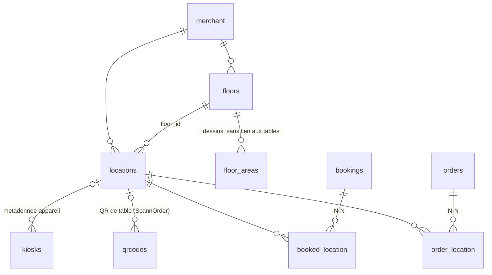

# Audit — Gestion des tables & plan de salle (WelloResto)

> **Date :** 2026-07-04
> **Périmètre :** lecture seule de `ib-welloresto-api` (Go/Chi/MySQL), `wello-back-office` (React), `wello_resto_flutter` (POS), `wello-kiosk`, `wello-resto-scannorder`.
> **Objectif :** préparer le cadrage technico-fonctionnel du module de réservation (attribution manuelle, Lot 1) et évaluer la distance au placement automatique à 100 % (chantier ultérieur).
> **Complément de :** `audit-reservation-existant.md` (2026-07-03).

**Résumé exécutif.** L'entité table est `locations`, avec une hiérarchie `floors` → `locations` et des zones dessinées (`floor_areas`) purement décoratives. Le modèle couvre l'affichage (géométrie complète : forme, position, dimensions, rotation) et le lien opérationnel commande↔table / réservation↔table via deux tables de liaison N-N. En revanche il ne connaît **ni combinaison de tables, ni adjacence, ni attributs, ni capacité min/max, ni appartenance table↔zone** : tout ce dont un algorithme de placement aurait besoin est absent. Deux défauts concrets sont par ailleurs bloquants dès le Lot 1 : la capacité (`seats`) modifiée dans l'éditeur back-office **n'est pas persistée** par l'API, et il n'existe **aucun endpoint pour (ré)affecter des tables à une réservation existante**. Recommandation : **option B — refonte progressive** (couche additive, pas de refonte du socle).

---

## 1. Cartographie du modèle de données

### 1.1 Tables SQL liées au plan de salle

⚠️ Comme pour les réservations, **aucune migration ne crée ces tables** — schéma hérité du backend PHP, reconstitué depuis les requêtes SQL du repo. Types et contraintes exactes (index, FK déclarées) non vérifiables en lecture seule.

**`locations`** — la table physique ([locations/repository.go:32-47](internal/modules/locations/repository.go#L32-L47), [173-175](internal/modules/locations/repository.go#L173-L175))

| Colonne | Type inféré | Usage |
|---|---|---|
| `location_id` | INT AUTO_INCREMENT PK | |
| `merchant_id` | FK `merchant.id` | Scoping mono-établissement |
| `floor_id` | FK `floors.id` (nullable côté front) | Étage d'appartenance |
| `location_name` | VARCHAR | « Table 1 », « Terrasse 4 »… |
| `location_desc` | VARCHAR NULLABLE | **Legacy** : lu partout, éditable nulle part (ni éditeur BO, ni payloads API) |
| `seats` | INT | Capacité unique (pas de min/max) |
| `location_order` | INT | Ordre d'affichage, auto-incrémenté par étage à la création |
| `shape` | VARCHAR | `circle` \| `square` \| `rectangle` |
| `current_x`, `current_y` | FLOAT | Position dans un canvas virtuel 1000×1000, sans unité réelle |
| `current_width`, `current_height` | FLOAT | Dimensions virtuelles (40–300 dans l'éditeur) |
| `angle` | FLOAT | Rotation en degrés (0–359) |
| `enabled` | BOOL | Soft delete |

**`floors`** — l'étage/salle : `id`, `merchant_id`, `name`, `enabled`. Pas d'ordre, pas de type (intérieur/terrasse), pas de capacité.

**`floor_areas`** — zones dessinées sur le plan : `id`, `floor_id`, `name`, `points` (JSON, polygone), `x`, `y`, `angle`, `stroke_color`, `color`, `enabled`. **Aucune relation avec `locations`** : une zone est un dessin, pas un conteneur. Aucun CRUD dans l'API (lecture seule dans `GET /locations`), aucun éditeur dans le back-office actuel — la donnée a été créée par un outil disparu (probablement l'ancien back-office PHP).

**`order_location`** — liaison N-N commande↔tables : `order_id`, `location_id`. Écrite par `order_life_cycle` (insert bulk à la création, delete/re-insert à la mise à jour, [repository.go:1481-1490](internal/modules/order_life_cycle/repository.go#L1481-L1490)).

**`booked_location`** — liaison N-N réservation↔tables : `booking_id`, `location_id`. Écrite uniquement à la création staff d'un booking ([bookings/repository.go:156-167](internal/modules/bookings/repository.go#L156-L167)). Aucune contrainte visible empêchant la double réservation d'une même table sur un créneau.

**Références périphériques :**
- `qrcodes.location_id` — QR de table pour ScannOrder (résolution table → commande ouverte, client de la résa en cours).
- `kiosks.location_id` — métadonnée d'appareil (migration 037), nullable, sans logique associée.

### 1.2 Schéma relationnel

Points structurants :
- La hiérarchie réelle est `merchant → floors → locations`. Les `floor_areas` sont un calque graphique parallèle, **pas un niveau hiérarchique**.
- Le statut d'une table n'est pas stocké : il est **dérivé** à la lecture (commande ouverte ? réservation acceptée à venir ?) — voir §1.6.
- Une réservation comme une commande peuvent occuper **plusieurs tables** : le mécanisme N-N existe déjà et fait office de « combinaison manuelle implicite ».

### 1.3 Coordonnées et géométrie

| Question | Réponse |
|---|---|
| Coordonnées x, y ? | Oui (`current_x`, `current_y`), canvas virtuel 1000×1000, snap grille 20 côté éditeur |
| Dimensions ? | Oui (`current_width`, `current_height`) + `shape` (rond/carré/rectangle) |
| Rotation ? | Oui (`angle`, degrés). L'éditeur BO la limite aux formes non rondes (slider 0–359, pas de 5°) ; le POS l'**arrondit au quart de tour** (0/90/180/270) au rendu ([floor_plan_canvas.dart:98-103](../wello_resto_flutter/lib/ui/widgets/dialogs/customer_location_table/plan/floor_plan_canvas.dart#L98-L103)) |
| Usage métier ? | **Affichage uniquement.** Aucune logique (collision, adjacence, distance, appartenance à une zone) ne lit la géométrie, ni côté Go, ni côté clients |

Conséquence pour le placement auto : les coordonnées existent mais **sans échelle réelle ni sémantique** (une distance de 40 unités ne dit pas si les tables sont accolées ou séparées par un couloir). En déduire l'adjacence par calcul serait fragile.

### 1.4 Combinaisons de tables

**Il n'existe aucune notion de combinaison dans le schéma.**

- Pas de flag « combinable avec X », pas d'entité `table_group` / `table_combination`, rien d'équivalent.
- Aucune adjacence, ni explicite (table de paires) ni dérivable fiablement (géométrie sans échelle, cf. §1.3).
- **Gestion actuelle d'un groupe de 6 sur deux tables de 3 :** sélection manuelle multiple. Le dialog POS de choix de tables est multi-sélection (`selectedLocationIds: Set<String>` dans le plan et la liste), et `booked_location` / `order_location` acceptent N tables par réservation/commande. C'est le staff qui « sait » quelles tables vont ensemble ; le système n'enregistre ni ne contrôle rien.

### 1.5 Capacité et attributs

- **Capacité :** une seule valeur, `seats` (1–20 dans l'éditeur). Pas de min/max (une table de 4 acceptable pour 2 mais pas pour 1, inexprimable), pas de capacité « en configuration banquet ».
- **Attributs :** aucun. Ni fumeur/terrasse/VIP/PMR/fenêtre, ni tags libres. Le seul champ libre est `location_desc`, legacy et non éditable. La notion « terrasse » ne peut être portée que par le nom de l'étage ou de la table.
- **Usage logique :** `seats` lui-même n'est **utilisé par aucune logique** — la disponibilité de réservation se calcule sur `hours_of_operation.booking_capacity` (couverts par plage horaire), jamais sur la somme des places des tables. `seats` est purement informatif à l'écran.
- ⚠️ **Bug bloquant :** l'éditeur BO permet d'éditer `seats` et `shape`, les envoie dans le PATCH, mais `UpdateTableRequest` côté Go ne porte que nom/ordre/étage/x/y/w/h/angle ([locations/models.go:14-24](internal/modules/locations/models.go#L14-L24)) → **les modifications de capacité et de forme sont silencieusement perdues** (seules les valeurs posées à la création existent).

### 1.6 Statuts et cycle de vie

Aucune colonne de statut sur `locations`. Tout est **calculé à la lecture** dans `GET /locations` ([locations/repository.go:32-79](internal/modules/locations/repository.go#L32-L79)) :

| Information | Source | Règle |
|---|---|---|
| `available` / `open_order_id` | `order_location` × `orders` | Occupée s'il existe une commande dans un état ≠ `DELETED/DONE/CANCELED/CLOSED` |
| `bookings[]` par table | `booked_location` × `bookings` | Réservations `ACCEPTED` dont `booking_date_to > UTC_NOW − 5h` (fenêtre magique en dur) |
| Hors service | `enabled = FALSE` | Confondu avec la suppression (soft delete) — pas d'état « indisponible temporairement » |

**Qui met à jour :** personne ne met à jour un statut de table directement. Le POS crée/ferme des commandes (via `order_life_cycle`), ce qui change l'occupation dérivée ; le module bookings accepte des résas, ce qui les fait apparaître sur les tables. Il n'existe **pas** d'états intermédiaires (« à débarrasser », « réservée dans 30 min », « installée ») ni de transition résa → commande sur table (le lien `bookings.order_id` existe en base mais aucun flux ne « seat » une réservation).

---

## 2. Éditeur back-office

### 2.1 Composant React (react-konva)

**Localisation :** page [Locations.tsx](../wello-back-office/src/pages/Locations.tsx), hook d'état [useFloorPlan.ts](../wello-back-office/src/hooks/useFloorPlan.ts), composants [components/locations/](../wello-back-office/src/components/locations/) (`FloorPlanCanvas`, `TableShape`, `TablePropertiesPanel`, `FloorSelector`, `ToolBar`), service API [locationsService.ts](../wello-back-office/src/services/locationsService.ts). Récent (commits « feature: plan de salle », 2026-05-22, synchrones avec « feature: crud tables » côté API).

**Fonctionnalités :**

| Fonction | Présent | Détail |
|---|---|---|
| Ajout | ✅ | 3 formes, posées en (500,500) avec dimensions par défaut |
| Déplacement | ✅ | Drag & drop (seulement si sélectionnée), clamp au canvas 1000×1000 |
| Redimensionnement | ✅ (panneau) | Sliders largeur/hauteur 40–300 — pas de poignées sur le canvas |
| Rotation | ✅ (panneau) | Slider 0–359°, pas de 5°, formes non rondes uniquement |
| Édition propriétés | ✅ | Nom, étage, places (1–20), forme |
| Suppression | ✅ | Avec confirmation (soft delete côté API) |
| Duplication | ❌ | |
| Étages | Partiel | Création seulement ; renommage/suppression appellent des endpoints inexistants (cf. 2.2) |
| Zones (`floor_areas`) | ❌ | Ni affichées ni éditables dans le BO actuel |
| Occupation temps réel | ❌ | `TableShape` a une prop `isOccupied` jamais alimentée |

**Sauvegarde :** modèle « dirty set » — les modifications sont locales, puis « Sauvegarder » émet un `PATCH /locations/tables/{location_id}` **par table modifiée** (pas de batch), avec payload `{location_name, seats, floor_id, shape, angle, x, y, width, height, enabled}`.

**Endpoints consommés :** `GET /locations`, `POST /floors`, `POST /locations/floors/{floor_id}/tables`, `PATCH /locations/tables/{id}`, `DELETE /locations/tables/{id}` — plus deux appels vers des routes **qui n'existent pas** côté API : `PATCH /floors/{id}` et `DELETE /floors/{id}`.

### 2.2 Cohérence avec le modèle back

- **Divergence de payload (perte de données) :** le front envoie `seats`, `shape`, `enabled` au PATCH ; l'API les ignore (cf. §1.5). Le front croit avoir sauvegardé — aucun retour d'erreur.
- **Endpoints fantômes :** `updateFloor`/`deleteFloor` du service front n'ont pas d'implémentation Go (seul `POST /floors` existe). Fonctionnent uniquement en mode mock (`VITE_USE_MOCK`).
- **Zones ignorées :** l'API renvoie `areas` dans `GET /locations`, le type front `LocationsData` ne déclare que `floors` + `locations` — la donnée est jetée.
- **Logique dupliquée :** clamp 1000×1000 et valeurs par défaut des dimensions existent côté front uniquement ; l'API n'applique **aucune validation** (on peut poser une table en x=−50, w=10000 par appel direct). Pas de duplication inverse (aucune logique front réimplémentée en Go).
- **Nettoyage :** `FloorCanvas.tsx`, `FloorSidebar.tsx`, `PropertiesPanel.tsx` sont des doublons non importés (code mort d'une première itération).

### 2.3 Combinaisons dans l'éditeur

Aucun support. L'endroit naturel pour les ajouter : le **panneau de propriétés** (`TablePropertiesPanel`) pour déclarer « combinable avec… » table par table, ou mieux un **mode canvas dédié** (sélection multiple → « créer une combinaison », visualisée par un liseré groupé), le canvas Konva se prêtant bien à la sélection de tables adjacentes. Prérequis : l'entité back correspondante (§5.5).

---

## 3. API exposée sur les tables

| Méthode | Path | Module | Rôle | Entrée | Sortie | Consommateurs |
|---|---|---|---|---|---|---|
| GET | `/locations` | locations | Plan complet : tables + occupation + résas + étages + zones | — | `{locations[], floors[], areas[]}` | POS Flutter (dialog tables), BO éditeur |
| PATCH | `/locations/{location_id}/coordinates` | locations | Déplacer une table (x,y seul) | `{x, y}` | `{status}` | **Orphelin** — aucun appelant trouvé (BO passe par `PATCH tables/{id}` ; POS ne déplace pas de tables) |
| POST | `/locations/floors/{floor_id}/tables` | locations | Créer une table | nom, seats, shape, x, y, w, h, angle | `{location_id}` | BO |
| PATCH | `/locations/tables/{location_id}` | locations | Modifier une table (⚠️ ignore seats/shape) | cf. §2.2 | `{status}` | BO |
| DELETE | `/locations/tables/{location_id}` | locations | Soft delete | — | `{status}` | BO |
| POST | `/floors` | locations | Créer un étage | `{name}` | `{floor_id}` | BO |
| GET | `/bookings/availability/{date}` | bookings | Dispo + liste `locations` (id, nom, desc seulement) | date | slots + locations | POS |
| POST | `/bookings/create` | bookings | Création résa **avec tables** (`booking.locations[]` → `booked_location`) | booking + customer + locations | booking | POS |
| POST | `/bookings/` (search) | bookings | Résas avec leurs tables jointes | filtres | bookings[] | POS |
| — | *(routes commandes)* | order_life_cycle | Commande créée/éditée avec `locations[]` → `order_location` | order payload | — | POS, ScannOrder (indirect) |

**Endpoints manquants au regard du Lot 1 :** il n'existe **aucun moyen d'affecter, modifier ou retirer les tables d'une réservation existante**. `booked_location` n'est écrite qu'à la création staff ; l'acceptation (`PATCH /bookings/{id}/accept`) ne prend aucun paramètre de table ; le flux public n'affecte jamais de table. Le geste central du Lot 1 — « une demande arrive, le staff l'accepte et lui attribue la table 12 » — n'a pas de route.

**Redondances/orphelins :** `PATCH /locations/{id}/coordinates` doublonne `PATCH /locations/tables/{id}` ; `bookings.loadMerchantLocations` recharge les locations sans géométrie (3ᵉ représentation de la même entité) ; endpoints floors fantômes appelés par le front (§2.2). Aucun RBAC au-delà de l'auth sur toutes ces routes.

---

## 4. Consommateurs de la modélisation actuelle

| Consommateur | Usage | Détail |
|---|---|---|
| **Flutter POS** | Fort — lecture | Dialog « client / table » à la prise de commande `IN` : onglet liste + onglet **plan graphique** ([plan/](../wello_resto_flutter/lib/ui/widgets/dialogs/customer_location_table/plan/)) qui projette `floor_areas` (peintre dédié) et les tables (position/dimensions/rotation arrondie à 90°). Multi-sélection de tables → `order_location`. Occupation affichée via `available`/`open_order_id` ; résas visibles par table (`bookings[]`). Ne modifie jamais la géométrie |
| **Flutter Kiosk** | Marginal | `kiosks.location_id` = métadonnée d'appareil ; l'app kiosk n'utilise pas les tables (commandes kiosk sans table) |
| **Back-office React** | Fort — écriture | Seul écrivain de la géométrie (éditeur Konva, §2). Pas de vue exploitation (occupation temps réel absente) |
| **Module orders / order_life_cycle** | Fort | `order_location` N-N ; le fetch commandes joint les tables (nom/desc) pour affichage tickets et historique. Résolution **par ID au moment de la lecture** : renommer une table change rétroactivement l'affichage des commandes passées (point d'attention NF525 : le nom de table n'est pas figé dans les données d'encaissement) |
| **Module bookings** | Moyen | Tables affectées à la création seulement ; jointure pour affichage ; `loadMerchantLocations` liste id/nom/desc dans la réponse de dispo |
| **Module reservation (public)** | Nul | Aucune notion de table dans le flux public |
| **ScannOrder** | Indirect | Le QR scanné porte `qrcodes.location_id` → résolution serveur de la table, de la commande ouverte et de la résa en cours ; le front SNO ne manipule pas de tables |

**Ampleur d'un changement de modèle :** la surface de lecture est large (POS, BO, orders, bookings, scannorder) mais presque tous les consommateurs lisent via `GET /locations` ou des jointures serveur. Tant qu'on **ajoute** (tables/colonnes nouvelles) sans toucher aux champs existants de `locations`, `order_location` et `booked_location`, l'impact client est quasi nul.

---

## 5. Analyse & recommandations

### 5.1 Points forts du modèle actuel

- **Liaisons N-N déjà en place** (`order_location`, `booked_location`) : une résa ou une commande sur plusieurs tables fonctionne aujourd'hui — c'est la moitié du besoin « combinaison » (l'enregistrement), il ne manque que la déclaration et le contrôle.
- **Géométrie complète et consommée** : forme, position, dimensions, rotation sont stockées et rendues par deux clients (BO, POS) avec le même référentiel virtuel 1000×1000. L'éditeur Konva est récent, propre, avec un modèle dirty-set correct.
- **Statut dérivé plutôt que stocké** : l'occupation calculée depuis les commandes ouvertes évite toute désynchronisation caisse/plan — un bon choix à conserver (NF525 : la caisse reste la source de vérité).
- **Chaîne table → QR → commande → résa** opérationnelle de bout en bout (ScannOrder).
- **Soft delete systématique** (`enabled`), cohérent avec le reste du repo.

### 5.2 Manques identifiés (vs besoins du module de réservation)

| Manque | Bloquant Lot 1 (attribution manuelle) | Bloquant placement auto |
|---|---|---|
| **Endpoint d'affectation de tables à une résa existante** (accept + assign, réassignation, retrait) | **Oui** — le geste central du cadrage n'a pas de route | Oui |
| **Contrôle de conflit table/créneau** (une table, deux résas qui se chevauchent : rien ne l'empêche) | **Oui** | Oui |
| **Persistance de `seats`** (bug PATCH, §1.5) | **Oui** — sans capacité fiable, même l'attribution manuelle est aveugle | Oui |
| **Combinaisons de tables** (déclaration + capacité combinée) | Non — le staff combine de tête via multi-sélection | **Oui — c'est le prérequis n°1** |
| **Adjacence / contraintes physiques** (« accolables sauf si couloir ») : inexprimable aujourd'hui ; la géométrie sans échelle ne permet pas de l'inférer | Non | **Oui.** Recommandation : la porter par les **combinaisons déclarées explicitement** (le restaurateur ne déclare que les combinaisons physiquement valides) plutôt que par un calcul géométrique |
| **Attributs de table** (PMR, fenêtre, VIP, terrasse…) | Non (nice-to-have pour filtrer à la main) | Oui (critères de l'algorithme) |
| **Capacité min/max par table** (`seats` unique aujourd'hui) | Non | Oui (éviter 2 couverts sur une table de 6) |
| **Durée de table variable selon capacité/zone** : aujourd'hui uniquement `bookings_settings.default_booking_duration` global (la maquette BO réservations prévoit `turnDurationMinutes` par zone — aucun équivalent back) | Non (durée globale acceptable) | Oui |
| **Zones exploitables** : `floor_areas` est un dessin sans membres ; aucune règle « ouvrir la terrasse à partir de 30 couverts » n'est exprimable | Non | Oui — il faut une appartenance table↔zone (FK), le polygone ne suffit pas |
| **Statuts d'exploitation** (à débarrasser, hors service temporaire, installée) | Partiel — « hors service » (≠ suppression) serait utile dès le Lot 1 | Oui |

### 5.3 Dette technique et risques

Par ordre de coût si non traité maintenant :

1. **Bug `seats`/`shape` non persistés** — perte de données silencieuse déjà effective ; toute donnée de capacité saisie depuis l'éditeur est fausse. À corriger avant toute fonctionnalité qui s'appuiera sur la capacité.
2. **Aucune contrainte d'unicité/conflit sur `booked_location`** — dès que l'attribution de tables devient un vrai flux (Lot 1), les doubles réservations de table seront un incident récurrent.
3. **Schéma non migré/documenté** (aucun DDL dans le repo) — chaque évolution (combinaisons, attributs) exigera des migrations sur des tables dont les contraintes réelles sont inconnues. Créer une migration « baseline » documentaire d'abord.
4. **Endpoints fantômes et orphelins** (`PATCH/DELETE /floors/{id}` appelés mais inexistants, `PATCH /coordinates` inutilisé, composants React morts) — bruit qui masquera les vraies régressions pendant le chantier.
5. **`floor_areas` sans propriétaire** : données produites par un outil disparu, non éditables, mais rendues par le POS. Toute refonte du plan doit décider de leur sort (reprendre l'édition ou déprécier).
6. **Validation géométrique inexistante côté API** — l'intégrité du plan repose entièrement sur le front.
7. **NF525 / historique** : le nom de table affiché sur les commandes passées est résolu au moment de la lecture. Un renommage réécrit visuellement l'historique d'encaissement. À figer (dénormaliser le libellé au moment de la clôture) si la traçabilité l'exige.
8. **Pas de RBAC** sur la modification du plan (tout token authentifié peut supprimer des tables).

### 5.4 Impact des évolutions probables

| Évolution | API Go | BO éditeur | POS Flutter | Kiosk | ScannOrder | Module orders |
|---|---|---|---|---|---|---|
| **A. Combinaisons de tables** (nouvelle table `location_combinations` + membres) | Moyen (entité + CRUD + intégration dispo) | Moyen (UI de déclaration) | Léger→moyen (affichage suggestion ; rien d'obligatoire tant que l'attribution reste multi-sélection) | Nul | Nul | Nul |
| **B. Enrichir attributs de table** (colonnes ou table `location_attributes`) | Léger (colonnes + payloads) | Léger (panneau propriétés) | Léger (badges facultatifs) | Nul | Nul | Nul |
| **C. Contraintes de proximité/adjacence** (table de paires ou via combinaisons) | Moyen | Moyen (mode d'édition dédié) | Nul (serveur only) | Nul | Nul | Nul |
| **D. Restructurer zones/sections** (FK `area_id` sur `locations`, capacité/règles par zone) | Moyen→lourd (touche `GET /locations`, dispo résa) | Moyen (reprendre l'édition des zones abandonnée) | Moyen (rendu du plan si le format `areas` change ; léger si additif) | Nul | Léger (résolution QR inchangée) | Léger |

Lecture : tant que les évolutions sont **additives** (A, B, C, et D en gardant `floor_areas` intact), aucun consommateur existant ne casse — le POS et le BO ignorent les champs inconnus. Le seul scénario « lourd » est une refonte **destructive** de la hiérarchie (remplacer floors/areas), à éviter.

### 5.5 Recommandations

**Option recommandée : B — refonte progressive.**

- **Contre A (extension pure)** : le modèle actuel n'a ni combinaisons, ni attributs, ni conflit de créneau — « enrichir sans refondre » sous-estime le fait qu'il faut aussi corriger des défauts structurels (bug seats, absence de contraintes, zones orphelines).
- **Contre C (refonte complète)** : le socle `floors → locations` + N-N est sain, consommé par 5 clients/modules, et adapté à 100 % du besoin Lot 1. Le remplacer serait un risque gratuit sur la caisse (NF525) pour un gain nul.

**Esquisse de plan (aligné sur les lots de l'audit réservation) :**

*Phase 0 — Assainissement (avec le Lot 1 réservation) :*
1. Migration baseline documentant `locations`, `floors`, `floor_areas`, `order_location`, `booked_location` + index utiles.
2. Correction du PATCH table (persister `seats`, `shape`) ; implémentation de `PATCH/DELETE /floors/{id}` ; suppression de l'endpoint `/coordinates` et du code mort front ; validation géométrique minimale côté API ; RBAC.
3. Endpoints d'attribution : `PUT /bookings/{id}/locations` (remplace l'affectation), contrôle de conflit table×créneau en transaction, accept-avec-tables.
4. État « hors service » distinct du soft delete (colonne `status` ou `out_of_service`).

*Phase 1 — Préparation du placement auto (peut suivre indépendamment) :*
5. `location_combinations` (id, merchant_id, nom, capacité min/max combinée, enabled) + `location_combination_members` (combination_id, location_id). Les combinaisons déclarées **remplacent l'inférence géométrique** : seules les combinaisons physiquement valides existent, ce qui règle la contrainte « couloir » sans modéliser l'adjacence.
6. Capacité min/max par table (`seats_min`, `seats_max` — `seats` devient l'affichage) + attributs (table `location_attributes` clé/valeur ou colonnes booléennes ciblées PMR/terrasse/fenêtre/VIP).
7. Appartenance table↔zone : FK `area_id` nullable sur `locations` (les `floor_areas` deviennent des conteneurs sans casser leur rôle graphique) + durée de rotation par zone.
8. Éditeur BO : mode « combinaisons » (multi-sélection → groupe), édition des zones, badges d'attributs.

À l'issue de la phase 1, un moteur de placement (scoring tables/combinaisons par party_size, attributs, zone, durée) devient une pure affaire d'algorithme serveur, sans nouvelle migration.

### 5.6 Questions à me poser

1. **Les `floor_areas` en production sont-elles réellement utilisées/à jour ?** Qui les a créées (ancien éditeur PHP ?) et faut-il en reprendre l'édition ou les déprécier au profit de zones-conteneurs ?
2. **Le canvas 1000×1000 a-t-il une échelle implicite** (une salle = tout le canvas ? des plans à l'échelle réelle sont-ils envisagés) ? Cela conditionne l'option « inférer l'adjacence par géométrie » que je déconseille en l'état.
3. **`location_desc` :** champ mort à supprimer, ou porte-t-il une donnée métier en prod (numéro de service, zone) qu'il faut requalifier en attributs ?
4. **`PATCH /locations/{id}/coordinates` :** un client hors workspace (ancien BO ? app interne ?) le consomme-t-il, ou peut-on le supprimer ?
5. **`kiosks.location_id` :** intention ? (borne rattachée à une zone de retrait ? commande kiosk sur table à terme ?) — cela pèse sur la décision zones.
6. **Le POS doit-il pouvoir éditer le plan** (déplacer une table en salle) ou l'édition reste-t-elle exclusivement back-office ? L'arrondi de rotation à 90° côté POS est-il un choix ou une limite technique ?
7. **NF525 :** faut-il figer le libellé de table sur les commandes clôturées (dénormalisation à la clôture), ou la résolution dynamique actuelle est-elle acceptée par l'expert conformité ?
8. **Capacité de référence pour la dispo :** le cadrage réservation prévoit-il de passer d'une capacité par plage horaire (`hours_of_operation.booking_capacity`, modèle actuel) à une capacité dérivée des tables/zones ? Les deux modèles coexistent mal et le choix structure la phase 1.
