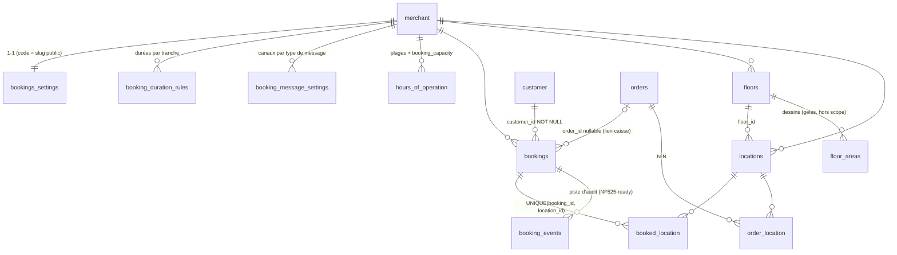

# Module de réservation WelloResto — Cadrage technico-fonctionnel Lot 1

| | |
|---|---|
| **Objet** | Cadrage technico-fonctionnel du Lot 1 (socle réservation) |
| **Date** | 2026-07-05 |
| **Références** | `cadrage-fonctionnel-reservation-welloresto.md` (v0.6), `audit-reservation-existant.md`, `audit-tables-plan-de-salle.md`, `audit-patch-coordinates.md` |
| **Périmètre** | Lot 1 uniquement (Phases 0 à 5 de la roadmap §10 du cadrage fonctionnel). Anti no-show (Lot 2), waitlist (Lot 3), CRM enrichi (Lot 4) et refonte plan de salle hors périmètre, mais compatibilité vérifiée en §1.5 |
| **Décision d'architecture** | Fusion de `internal/modules/reservation/` + `internal/modules/bookings/` en un module unique `internal/modules/booking/` : un service/domaine, deux handlers (staff + public), les préfixes de routes `/bookings` et `/rsv/{slug}` inchangés |

---

## 1. Modèle de données cible (Lot 1)

Convention : **[EXISTANT]** déjà en base, inchangé · **[MODIFIÉ]** colonne/contrainte à faire évoluer · **[NOUVEAU]** à créer · **[SUPPRIMÉ]** à retirer.

⚠️ Aucune table métier réservation/plan de salle n'a de DDL dans le repo (héritage PHP). Les types ci-dessous sont **inférés des requêtes** ; la migration baseline (§1.4) devra d'abord figer le schéma réel via `SHOW CREATE TABLE` en production.

### 1.1 Schéma cible complet

#### `bookings` — [MODIFIÉ]

| Colonne | Type | État | Remarques |
|---|---|---|---|
| `booking_id` | INT AUTO_INCREMENT PK | [EXISTANT] | PK legacy conservée (contrat POS existant) — pas de bascule vers `GeneratePrefixedID` sur cette table |
| `booking_number` | VARCHAR(6) NOT NULL | [MODIFIÉ] | Ajouter **UNIQUE `(merchant_id, booking_number)`** (aujourd'hui unicité par boucle applicative seulement) — cf. point ouvert §7.1 |
| `merchant_id` | FK `merchant.id` NOT NULL | [EXISTANT] | |
| `customer_id` | FK `customer.customer_id` NOT NULL | [EXISTANT] | Toujours renseigné après refonte (upsert obligatoire, y compris flux public) |
| `order_id` | FK `orders.order_id` NULL | [EXISTANT] | Lien caisse, détaché par `order_life_cycle.ClearBookings` |
| `booking_date_from` / `booking_date_to` | DATETIME NOT NULL | [MODIFIÉ] | **Convention cible : UTC en base**, conversion timezone marchand en I/O (aujourd'hui heure locale). Migration de données requise — cf. §1.4 M-056 et point ouvert §7.7 |
| `booking_duration` | INT (minutes) | [EXISTANT] | Redondant avec from/to, conservé pour lecture rapide ; toujours renseigné après refonte (le public l'omet aujourd'hui) |
| `party_size` | INT NOT NULL | [EXISTANT] | |
| `status` | VARCHAR(32) NOT NULL | [MODIFIÉ] | Vocabulaire normalisé en minuscules : `pending`, `confirmed`, `seated`, `completed`, `cancelled`, `denied`, `no_show` (cf. §5.1). Migration de mapping des valeurs legacy |
| `source` | VARCHAR(16) NOT NULL DEFAULT 'staff' | [NOUVEAU] | `staff` \| `web` \| `phone` \| `walk_in` (\| `google` post-Lot 1). Remplace l'usage détourné de `created_by` (`WR_ONLINE_BOOKING`) |
| `sequence_number` | INT DEFAULT 0 | [EXISTANT] | Compteur de modifications client |
| `comment` | TEXT NULL | [EXISTANT] | |
| `creation_date` | DATETIME NOT NULL (UTC) | [MODIFIÉ] | Rendre NOT NULL avec DEFAULT `UTC_TIMESTAMP` (le flux public ne le renseignait pas) |
| `created_by` | VARCHAR NULL | [MODIFIÉ] | Redevient un `user_id` pur (nullable pour le public), le littéral `WR_ONLINE_BOOKING` migre vers `source='web'` |
| `deletion_date`, `deletion_reason_id` | | [SUPPRIMÉ] | Code mort (`CancelBookingDB` jamais appelé, motif `'9'` magique). Colonnes conservées en base (données historiques) mais retirées du code ; suppression physique différée |
| **Index** | | [NOUVEAU] | `idx_bookings_merchant_date (merchant_id, booking_date_from)` ; `idx_bookings_merchant_status (merchant_id, status)` ; UNIQUE `(merchant_id, booking_number)` |

#### `booking_events` — [NOUVEAU]

Piste d'audit des transitions — fondation de la traçabilité NF525 exigée dès que le Lot 2 branchera des flux monétaires (empreinte/acompte).

| Colonne | Type | Remarques |
|---|---|---|
| `event_id` | VARCHAR(64) PK | `helpers.GeneratePrefixedID("bke")` — convention repo |
| `booking_id` | FK `bookings.booking_id` NOT NULL | |
| `merchant_id` | FK `merchant.id` NOT NULL | Scoping direct pour requêtes de pilotage |
| `event_type` | VARCHAR(32) NOT NULL | `created`, `status_changed`, `updated`, `locations_assigned`, `reminder_sent`… |
| `old_status` / `new_status` | VARCHAR(32) NULL | Renseignés pour `status_changed` |
| `actor_type` | VARCHAR(16) NOT NULL | `staff` \| `customer` \| `system` |
| `actor_id` | VARCHAR(64) NULL | `user_id` si staff |
| `payload` | JSON NULL | Détail de la modification (diff dates, tables affectées…) |
| `created_at` | DATETIME NOT NULL DEFAULT UTC_TIMESTAMP | |
| **Index** | | `(booking_id, created_at)` |

#### `booked_location` — [MODIFIÉ]

| Colonne | Type | État | Remarques |
|---|---|---|---|
| `booking_id` | FK `bookings.booking_id` | [EXISTANT] | |
| `location_id` | FK `locations.location_id` | [EXISTANT] | |
| **Contrainte** | UNIQUE `(booking_id, location_id)` | [NOUVEAU] | Empêche les doublons d'affectation. Le conflit **table × créneau** ne peut pas être une contrainte SQL (dépend des dates) : contrôle applicatif en transaction (§6.3) |
| **Index** | `(location_id)` | [NOUVEAU] | Requête de conflit et vue plan de salle |

#### `bookings_settings` — [MODIFIÉ]

1-1 marchand, ligne créée à l'init (`pos/create_repository.go:103`, défauts DB).

| Colonne | Type | État | Remarques |
|---|---|---|---|
| `merchant_id` | FK UNIQUE | [EXISTANT] | |
| `code` | VARCHAR | [EXISTANT] | Slug public `/rsv/{slug}` |
| `enabled` | TINYINT(1) | [EXISTANT] | Module actif côté public |
| `default_booking_duration` | INT (min) | [EXISTANT] | Devient le **fallback** quand aucune règle par tranche ne matche |
| `slot_interval_minutes` | INT | [EXISTANT] | |
| `auto_accept_reserve_bookings` | TINYINT(1) | [EXISTANT] | |
| `reserve_maximum_party_size` | INT | [EXISTANT] | Groupe max — au-delà : redirection appel resto côté front |
| `reserve_minimum_party_size` | INT DEFAULT 1 | [NOUVEAU] | Groupe min (règle §7 cadrage fonctionnel) |
| `first_booking_offset_minutes` | INT | [SUPPRIMÉ] | Lu mais jamais exploité (audit) — retiré du code, colonne conservée |
| `last_booking_offset_minutes` | INT | [EXISTANT] | Coupure fin de service (utilisé par le moteur unifié, cohabite avec `last_booking_time` par plage — la plage prime, cf. §6.1) |
| `min_booking_notice_minutes` | INT DEFAULT 60 | [NOUVEAU] | Fenêtre min : délai de coupure avant le créneau |
| `max_booking_horizon_days` | INT DEFAULT 90 | [NOUVEAU] | Fenêtre max : réservation à l'avance |
| `overbooking_percent` | INT DEFAULT 0 | [NOUVEAU] | Capacité effective = `booking_capacity × (1 + overbooking_percent/100)` |
| `max_customer_updates` | INT DEFAULT 3 | [NOUVEAU] | Paramètre remplaçant la constante `MaximumSequenceNumber = 3` en dur |
| `cancelable_by_customer` | TINYINT(1) | [EXISTANT] | |
| `cancel_booking_limit_offset_hours` | INT | [EXISTANT] | |

#### `booking_duration_rules` — [NOUVEAU]

Durée de table variable par tranche de taille de groupe (règle Must §7 du cadrage fonctionnel).

| Colonne | Type | Remarques |
|---|---|---|
| `rule_id` | VARCHAR(64) PK | `GeneratePrefixedID("bdr")` |
| `merchant_id` | FK NOT NULL | |
| `party_size_min` / `party_size_max` | INT NOT NULL | Tranche inclusive ; non-chevauchement validé côté service |
| `duration_minutes` | INT NOT NULL | Buffer inclus (arbitrage cadrage) |
| `enabled` | TINYINT(1) DEFAULT 1 | Soft delete convention repo |

#### `booking_message_settings` — [NOUVEAU]

Paramétrage granulaire des communications (Phase 5). Une ligne par type de message et par marchand.

| Colonne | Type | Remarques |
|---|---|---|
| `id` | VARCHAR(64) PK | `GeneratePrefixedID("bms")` |
| `merchant_id` | FK NOT NULL | UNIQUE `(merchant_id, message_type)` |
| `message_type` | VARCHAR(32) NOT NULL | Lot 1 : `confirmation`, `pending_ack`, `denied`, `updated`, `cancelled`, `reminder`. (Lot 2+ : `reconfirm_request`, `no_show_followup`, `post_visit`) |
| `email_enabled` | TINYINT(1) DEFAULT 1 | Email toujours activé par défaut (coût nul) |
| `sms_enabled` | TINYINT(1) DEFAULT 0 | Opt-in, mention surfacturation côté BO |
| `reminder_offset_minutes` | INT NULL | Uniquement pour `reminder` (défaut proposé : 1440 = J-1) |

Contenus textuels : par défaut, fournis par WelloResto, **non stockés en base au Lot 1** (templates Brevo/Go embarqués). L'édition de templates est une évolution (Could).

#### `hours_of_operation` — [EXISTANT, corrections d'usage]

| Colonne | Type | État |
|---|---|---|
| `id`, `merchant_id`, `day_of_week_from`, `day_of_week_to` (1=lundi…7=dimanche), `hour_from`, `hour_to`, `booking_capacity`, `first_booking_time`, `last_booking_time`, `valid_from`, `valid_to`, `enabled` | | [EXISTANT] |

Pas de changement de schéma. Deux corrections d'usage : le moteur unifié doit **respecter `day_of_week_to`** (les requêtes actuelles filtrent uniquement sur `day_of_week_from` alors que le POS écrit des plages from→to), et ajouter l'index `(merchant_id, day_of_week_from, enabled)`.

#### `locations` — [MODIFIÉ]

| Colonne | Type | État | Remarques |
|---|---|---|---|
| `location_id` INT PK, `merchant_id`, `floor_id`, `location_name`, `seats`, `location_order`, `shape`, `current_x/y/width/height`, `angle`, `enabled` | | [EXISTANT] | |
| `location_desc` | VARCHAR NULL | [EXISTANT] | Legacy, lu partout / éditable nulle part — statu quo Lot 1 (cf. question §10.3) |
| `out_of_service` | TINYINT(1) DEFAULT 0 | [NOUVEAU] | État « hors service temporaire » distinct du soft delete `enabled` (recommandation audit tables §5.5-4). **Optionnel Lot 1** (S) — si arbitré out, reporter au chantier plan de salle |

Correction applicative bloquante (pas de migration) : `UpdateTableRequest` doit persister `seats` et `shape` (aujourd'hui silencieusement perdus — [locations/models.go:14-24](internal/modules/locations/models.go#L14-L24)).

#### `floors` — [EXISTANT]

`id`, `merchant_id`, `name`, `enabled`. Aucun changement de schéma ; ajout des endpoints PATCH/DELETE manquants (§2.4).

#### `floor_areas` — [EXISTANT, gelé]

Calque purement décoratif, rendu par le POS, sans CRUD. **Aucune intervention au Lot 1** — son sort (zones-conteneurs) appartient au chantier plan de salle.

#### `customer` — [EXISTANT]

Aucun changement de schéma au Lot 1. Le flux public bascule sur l'upsert du module `customers` (`UpsertCustomer`, testé). La fiche client partagée multi-établissement est un chantier de schéma majeur **hors Lot 1** (Lot 4, cf. audit §5.5).

### 1.2 Diagramme relationnel (cible Lot 1)



### 1.3 Évolutions par rapport à l'existant

| # | Table | Évolution | Justification (règle métier) | Impact NF525 |
|---|---|---|---|---|
| E1 | toutes (legacy) | Migration baseline documentaire (DDL figé + index) | Pré-requis à toute évolution : contraintes réelles inconnues (audit tables §5.3-3) | Neutre |
| E2 | `bookings` | UNIQUE `(merchant_id, booking_number)` | Le numéro est la clé d'accès du client à sa résa ; unicité applicative seule = collision possible | Neutre |
| E3 | `bookings` | Normalisation `status` (7 valeurs, mapping legacy) | Statuts cible §5.1 ; supprime `'0'` et le mélange de vocabulaires | Indirect (états stables = audit lisible) |
| E4 | `bookings` | Colonne `source` | Distinguer web/staff/téléphone/walk-in (pilotage, maquette BO) ; libère `created_by` | Neutre |
| E5 | `booking_events` | Nouvelle table | Historisation des transitions + acteur + horodatage. Fondation traçabilité avant tout flux d'encaissement Lot 2 | **Fondateur** — piste d'audit exigible dès qu'un acompte se déduit d'une addition |
| E6 | `booked_location` | UNIQUE + index `location_id` | Support du contrôle de conflit table × créneau (Must Phase 0) | Neutre |
| E7 | `bookings_settings` | + `min_booking_notice_minutes`, `max_booking_horizon_days`, `overbooking_percent`, `reserve_minimum_party_size`, `max_customer_updates` | Règles arbitrées §7 du cadrage fonctionnel (fenêtre min/max, overbooking %, groupes min/max, limite de modifs paramétrable) | Neutre |
| E8 | `booking_duration_rules` | Nouvelle table | Durée de table variable par tranche + fallback (Must) | Neutre |
| E9 | `booking_message_settings` | Nouvelle table | Paramétrage activation/canal par type de message (Must 6.4) | Neutre |
| E10 | `bookings` dates | Bascule UTC | Unifier le moteur (aujourd'hui staff=UTC vs public=timezone : grilles divergentes) ; aligné sur le reste de l'API (`UTC_TIMESTAMP`) | Neutre |
| E11 | `locations` | + `out_of_service` (optionnel) | Table indisponible ≠ table supprimée | Neutre |
| E12 | `bookings` | `deletion_date`/`deletion_reason_id` retirés du code | Code mort (audit §1.3) | Neutre |

### 1.4 Migrations SQL nécessaires

Convention repo : `migrations/NNN_nom.up.sql` + `.down.sql` (dernière : `049`), exécution manuelle, déplacement dans `done/` après application.

**Assainissement (rattrapage héritage PHP)** :

| # | Nom | Contenu |
|---|---|---|
| 050 | `050_baseline_floorplan.up.sql` | DDL documentaire (`CREATE TABLE IF NOT EXISTS`) de `locations`, `floors`, `floor_areas`, `order_location`, `booked_location`, à partir du `SHOW CREATE TABLE` prod. + index `booked_location(location_id)` |
| 051 | `051_baseline_bookings.up.sql` | DDL documentaire de `bookings`, `bookings_settings`, `hours_of_operation`. + index `bookings(merchant_id, booking_date_from)`, `bookings(merchant_id, status)`, `hours_of_operation(merchant_id, day_of_week_from, enabled)` |
| 052 | `052_booked_location_unique.up.sql` | Dédoublonnage préalable puis UNIQUE `(booking_id, location_id)` |

**Évolution (nouveautés Lot 1)** :

| # | Nom | Contenu |
|---|---|---|
| 053 | `053_bookings_status_source.up.sql` | Mapping statuts legacy → cible (`PENDING_APPROVAL→pending`, `ACCEPTED→confirmed`, `ORDER_OPEN→seated`, `'0'→completed`, `CANCELED→cancelled`, `DENIED→denied`) ; colonne `source` + backfill (`created_by='WR_ONLINE_BOOKING'→'web'`, sinon `'staff'`) ; dédoublonnage + UNIQUE `(merchant_id, booking_number)` (les numéros vides du flux public défectueux sont régénérés) ; `creation_date` NOT NULL DEFAULT |
| 054 | `054_booking_events.up.sql` | Table `booking_events` |
| 055 | `055_bookings_settings_lot1.up.sql` | Nouvelles colonnes `bookings_settings` (E7) + tables `booking_duration_rules`, `booking_message_settings` + seed des lignes de messages par défaut pour les marchands existants |
| 056 | `056_bookings_dates_utc.up.sql` | Conversion des `booking_date_from/to` existants heure locale → UTC (`CONVERT_TZ` par timezone marchand). **Conditionnée à la réponse §10.1 (PHP encore écrivain ?)** — si non tranchée, le moteur reste en timezone marchand et cette migration est annulée (cf. §7.7) |
| 057 | `057_locations_out_of_service.up.sql` | Colonne `out_of_service` (si arbitrée) |

Chaque `.up` a son `.down` (convention depuis 026). Le mapping de statuts 053 doit être réversible (table de correspondance dans le `.down`).

### 1.5 Modèle post-Lot 1 (aperçu de compatibilité)

La refonte plan de salle ajoutera, **sans casser le modèle Lot 1** (toutes les évolutions sont additives — audit tables §5.4) :

- `location_combinations` + `location_combination_members` : combinaisons déclarées (l'audit recommande la déclaration explicite plutôt que l'inférence géométrique seule ; le cadrage fonctionnel maintient l'inférence comme cible — les deux convergent vers ces mêmes tables, l'inférence devenant un *assistant de déclaration*).
- `locations.seats_min` / `seats_max` (le `seats` actuel devient l'affichage), attributs (PMR, terrasse, VIP, fenêtre) en colonnes ou table clé/valeur.
- FK `locations.area_id` → `floor_areas` (zones-conteneurs) + durée de rotation par zone.
- Sémantique de distance : colonne d'échelle sur `floors`.
- Obstacles : nouvelle table `floor_obstacles` (mur, bar, escalier, porte + sens d'ouverture).

Garanties de compatibilité prises au Lot 1 : `booked_location` reste la seule table d'affectation (une combinaison affectée = N lignes, inchangé) ; le contrôle de conflit §6.3 fonctionne tel quel table par table ; le moteur de disponibilité expose une interface où la source de capacité (`booking_capacity` par plage) est isolée derrière une fonction unique, remplaçable par un calcul par tables/zones sans toucher aux appelants.

---

## 2. Endpoints cibles par module

Auth : `staff` = `authMiddleware` + `RequirePermission(HasBookingsAccess)` (nouveau helper dans [internal/middleware/permissions.go](internal/middleware/permissions.go), même pattern que `HasPlanningAccess`) ; `public` = aucun auth, rate-limit + validations strictes ; `BO` = staff avec `HasSettingsAccess` pour le paramétrage.

### 2.1 Module `/bookings` (staff — Flutter POS, BO React)

| Méthode | Path | Rôle métier | Payload IN | Payload OUT | Auth | Consommateurs |
|---|---|---|---|---|---|---|
| POST | `/bookings/` | Recherche / carnet (jour, semaine, statut) | `{booking_id?, booking_number?, booking_date_from?, booking_date_to?, status?, page?, page_size?}` | `{bookings: BookingStaff[], total, page}` | staff | POS, BO |
| GET | `/bookings/availability/{date}` | Grille de dispo staff (mêmes créneaux que le public + occupation + capacité restante) | date `YYYY-MM-DD` (timezone marchand) | `AvailabilityResponse` étendu staff (occupation, tables) | staff | POS |
| POST | `/bookings/create` | Prise de résa manuelle (avec tables optionnelles) | `{booking:{start_date, party_size, comment?, source?, locations[]?}, customer:{name, tel, email?}}` | `{booking: BookingStaff}` | staff | POS |
| GET | `/bookings/{booking_id}` | Détail | — | `{booking: BookingStaff}` | staff | POS |
| PATCH | `/bookings/{booking_id}` | **Modification staff** (date, couverts, commentaire) — absent aujourd'hui | `{start_date?, party_size?, comment?}` | `{booking: BookingStaff}` | staff | POS |
| PATCH | `/bookings/{booking_id}/accept` | Acceptation, **avec attribution de tables optionnelle** | `{locations[]?: location_id[]}` | `{booking: BookingStaff}` | staff | POS |
| PATCH | `/bookings/{booking_id}/deny` | Refus d'une demande `pending` | `{reason?}` | `{booking: BookingStaff}` | staff | POS |
| PATCH | `/bookings/{booking_id}/cancel` | **Annulation staff** d'une résa confirmée (sémantique ≠ deny) | `{reason?}` | `{booking: BookingStaff}` | staff | POS |
| PUT | `/bookings/{booking_id}/locations` | **Attribution / réattribution / retrait de tables** (remplacement complet, pattern `order_location`) | `{locations: location_id[]}` (liste vide = retrait) | `{booking: BookingStaff}` ou 409 `table_conflict` | staff | POS |
| PATCH | `/bookings/{booking_id}/seated` | Marquer la résa installée (transition `confirmed→seated`, pont vers l'ouverture de commande) | — | `{booking: BookingStaff}` | staff | POS |

Notes : la recherche reste en `POST /bookings/` pour préserver le contrat POS existant (l'audit n'a pas confirmé que le POS est librement modifiable — question §10.4) ; pagination et filtre `status` sont additifs. Les champs `Debug*` de `BookingSlot` sont supprimés de la réponse.

### 2.2 Module `/reservation` (public — routes `/rsv/{slug}`)

Toutes les routes : middleware rate-limit (nouveau, cf. §6.7) + `bookings_settings.enabled = 1`.

| Méthode | Path | Rôle métier | Payload IN | Payload OUT | Auth | Consommateurs |
|---|---|---|---|---|---|---|
| GET | `/rsv/{slug}/open-hours` | Fiche resto publique (design, adresse, horaires) | — | `{merchant: MerchantPublic, open_days[]}` — jours en **clés ISO** (`1..7`), i18n côté front (plus de français en dur) | public | App web |
| GET | `/rsv/{slug}/booking-availability` | Créneaux disponibles | `?date=YYYY-MM-DD&party_size=N` (date lisible, plus de timestamp Unix) | `{slots: PublicSlot[]}` (§5.3) | public | App web |
| POST | `/rsv/{slug}/booking/create` | Prise de résa client | `{booking:{start_date, party_size, comment?}, customer:{name, tel, email?}}` + header `Idempotency-Key` | `201 {booking: BookingPublic}` / `409 slot_unavailable` / `422 party_size_out_of_bounds` | public | App web |
| GET | `/rsv/{slug}/booking/{booking_number}` | Suivi de sa résa | — (le numéro **dans le path**, plus de `?number=` redondant) | `{booking: BookingPublic}` | public | App web |
| PATCH | `/rsv/{slug}/booking/{booking_number}` | Modification client (date/couverts) avec **re-check de dispo** | `{start_date?, party_size?}` | `{booking: BookingPublic}` / `409` / `403 too_late_to_edit` | public | App web |
| DELETE | `/rsv/{slug}/booking/{booking_number}` | Annulation client | — | `204` / `403 too_late_to_cancel` | public | App web |
| POST | `/rsv/{slug}/booking/{booking_number}/confirm` | Reconfirmation client (lien du rappel J-1) | — | `{booking: BookingPublic}` | public | App web (Phase 5 ; la *demande* automatique de reconfirmation paramétrable est Lot 2) |

Ruptures de contrat assumées (le front public actuel n'est vraisemblablement pas branché — flux création inopérant, cf. audit §3.3 et question §10.5) : date lisible au lieu d'un timestamp, numéro dans le path, verbes REST (`PATCH`/`DELETE`), statuts HTTP réels au lieu du champ `status: "1"/"-2"`, erreurs SQL jamais exposées.

### 2.3 Module `/bookings/settings` (BO paramétrage)

| Méthode | Path | Rôle métier | Payload IN | Payload OUT | Auth | Consommateurs |
|---|---|---|---|---|---|---|
| GET | `/bookings/settings` | Lecture complète du paramétrage | — | `BookingSettings` (§5.4) | staff + `HasSettingsAccess` | BO |
| PATCH | `/bookings/settings` | Mise à jour partielle (pointeurs à la `UpdateTableRequest`) | sous-ensemble de `BookingSettings` | `BookingSettings` | idem | BO |
| GET | `/bookings/settings/duration-rules` | Liste des durées par tranche | — | `{rules: DurationRule[]}` | idem | BO |
| PUT | `/bookings/settings/duration-rules` | Remplacement complet des tranches (validation non-chevauchement) | `{rules: [{party_size_min, party_size_max, duration_minutes}]}` | `{rules}` / `422 overlapping_ranges` | idem | BO |
| GET | `/bookings/settings/messages` | Paramétrage des messages | — | `{messages: MessageSetting[]}` | idem | BO |
| PATCH | `/bookings/settings/messages/{message_type}` | Activation / canaux d'un type de message | `{email_enabled?, sms_enabled?, reminder_offset_minutes?}` | `{message}` | idem | BO |
| GET | `/bookings/settings/capacity-check` | **Warning capacité paramétrée vs physique** : compare chaque `booking_capacity` de plage à `SUM(locations.seats)` du marchand | — | `{physical_capacity, ranges: [{hoo_id, booking_capacity, exceeds: bool}]}` | idem | BO |

Les shifts / `hours_of_operation` restent administrés par le module `pos` existant (`POST/PATCH/DELETE /pos/settings/hours_of_operations…`, [routes.go:549-551](cmd/api/routes.go#L549-L551)) — pas de doublon d'API ; l'écran BO Réservations les consomme.

### 2.4 Modules `/locations` & `/floors` (BO plan de salle)

| Méthode | Path | Rôle métier | Payload IN | Payload OUT | Auth | Consommateurs | Δ |
|---|---|---|---|---|---|---|---|
| GET | `/locations` | Plan complet (tables + occupation + résas + étages + zones) | — | `{locations[], floors[], areas[]}` | staff | POS, BO | inchangé |
| POST | `/locations/floors/{floor_id}/tables` | Créer une table | nom, seats, shape, x, y, w, h, angle | `{location_id}` | staff + `HasSettingsAccess` | BO | + RBAC |
| PATCH | `/locations/tables/{location_id}` | Modifier une table | + **`seats`, `shape`** (bug corrigé), validation géométrique min (clamp 0-1000, dims 40-300) | `{status}` | idem | BO | corrigé |
| DELETE | `/locations/tables/{location_id}` | Soft delete | — | `{status}` | idem | BO | + RBAC |
| POST | `/floors` | Créer un étage | `{name}` | `{floor_id}` | idem | BO | + RBAC |
| PATCH | `/floors/{floor_id}` | **Renommer un étage** (attendu par le BO, inexistant) | `{name}` | `{status}` | idem | BO | **créer** |
| DELETE | `/floors/{floor_id}` | **Supprimer un étage** (soft delete ; refus `409` si tables actives rattachées) | — | `{status}` / `409 floor_not_empty` | idem | BO | **créer** |
| PATCH | `/locations/{location_id}/coordinates` | Déplacer (x,y) | | | | **aucun** | **supprimer** (verdict A du mini-audit, après contrôle logs 30 j) |

### 2.5 Endpoints partagés / transverses touchés par le Lot 1

| Méthode | Path | Module | Impact Lot 1 |
|---|---|---|---|
| — | `customers.UpsertCustomer` (interne, pas de route) | customers | Appelé par le flux public refondu (création propre de fiche si téléphone inconnu, scoping merchant forcé côté serveur — jamais le `customer_id` du payload) |
| GET/POST/PATCH/DELETE | `/pos/settings/hours_of_operations*` | pos | Inchangés ; consommés par l'écran BO Réservations pour les shifts |
| GET | `/locations` | locations | La fenêtre magique « bookings des 5 dernières heures » ([locations/repository.go:79](internal/modules/locations/repository.go#L79)) est remplacée par « `confirmed`/`seated` du jour courant timezone marchand » |
| — | `order_life_cycle.ClearBookings` | order_life_cycle | Mise à jour du mapping : à la clôture de commande, `status='0'` devient `status='completed'` + événement `booking_events` |
| — | `scannorder.GetBooking` | scannorder | Adapter le filtre de statut (`ACCEPTED` → `confirmed`/`seated`) |
| WS/FCM | hub `internal/infrastructure/websocket` + FCM | infrastructure | Nouveaux événements `booking.created`, `booking.updated`, `booking.cancelled` vers le POS (Phase 3) |
| — | `internal/tasks/notifications.go#SendBookingReminders` | tasks | Implémentation réelle du stub + réactivation ciblée du cron (Phase 5) |

---

## 3. Table de comparaison avec l'existant

Efforts : **S** < 0,5 j · **M** 0,5–2 j · **L** 2–5 j · **XL** > 5 j. (Efforts backend Go, hors clients.)

| Endpoint cible | État actuel | Verdict | Effort | Justification |
|---|---|---|---|---|
| POST `/bookings/` (recherche) | Existe et OK (sans pagination/filtre statut) | Compléter | S | Ajouter pagination + filtre `status`, retirer rien du contrat |
| GET `/bookings/availability/{date}` | Existe mais bugué (calcul UTC, `day_of_week_to` ignoré, champs debug) | Refondre | L | Rebranché sur le moteur unifié (compté dans T-10) |
| POST `/bookings/create` | Existe et OK (transactionnel, upsert client) | Compléter | M | + contrôle capacité/conflit à l'écriture, `source`, événement |
| GET `/bookings/{id}` | Existe et OK | Garder tel quel | S | Seul le DTO évolue (statuts normalisés) |
| PATCH `/bookings/{id}` (modif staff) | Absent | Créer | M | Modif date/couverts avec re-check capacité |
| PATCH `/bookings/{id}/accept` | Existe mais partiel (pas de tables, pas d'email, logique couplée au contexte user) | Refondre | M | Accept-avec-tables + extraction de la logique hors RBAC + événement |
| PATCH `/bookings/{id}/deny` | Existe mais partiel | Compléter | S | Événement + notification ; même extraction que accept |
| PATCH `/bookings/{id}/cancel` (staff) | Absent (confondu avec deny) | Créer | S | Transition dédiée `confirmed→cancelled` |
| PUT `/bookings/{id}/locations` | **Absent — geste central du Lot 1 sans route** | Créer | M | Remplacement complet + contrôle de conflit en transaction |
| PATCH `/bookings/{id}/seated` | Absent (lien `order_id` existe mais aucun flux « seat ») | Créer | S | Transition + pont vers commande |
| GET `/rsv/{slug}/open-hours` | Existe mais partiel (jours français en dur) | Compléter | S | Clés ISO, i18n front |
| GET `/rsv/{slug}/booking-availability` | Existe mais divergent du staff (timezone, offsets) | Refondre | L | Même moteur unifié que le staff (compté dans T-10) |
| POST `/rsv/{slug}/booking/create` | **Existe mais inopérant** (pas de `booking_number`, pas de création client, auto-accept cassé) | Refondre | L | Les 3 défauts bloquants de l'audit + idempotence + rate-limit |
| GET `/rsv/{slug}/booking/{number}` | Existe (path param ignoré, `?number=`) | Refondre | S | Numéro en path, DTO `BookingPublic`, statuts HTTP |
| PATCH `/rsv/{slug}/booking/{number}` | Existe mais bugué (pas de re-check dispo, decode non contrôlé → panic) | Refondre | M | Re-check capacité, limite de modifs paramétrable |
| DELETE `/rsv/{slug}/booking/{number}` | **Existe mais cassé** (passe par `DenyBooking` + `UserFromContext` → échec systématique) | Refondre | S | Annulation directe sans dépendance au contexte staff |
| POST `/rsv/{slug}/booking/{number}/confirm` | Absent | Créer | S | Transition `reconfirmed` (flag ou événement) |
| GET `/bookings/settings` | **Absent** (réglages administrables uniquement en SQL) | Créer | M | GET+PATCH ensemble |
| PATCH `/bookings/settings` | Absent | Créer | — | compté ci-dessus |
| GET/PUT `/bookings/settings/duration-rules` | Absent (durée unique globale) | Créer | M | Table neuve + validation chevauchement |
| GET/PATCH `/bookings/settings/messages` | Absent | Créer | S | CRUD simple sur table neuve |
| GET `/bookings/settings/capacity-check` | Absent | Créer | S | Une requête d'agrégat |
| GET `/locations` | Existe et OK (fenêtre 5 h magique à corriger) | Compléter | S | Filtre bookings du jour + statuts normalisés |
| PATCH `/locations/tables/{id}` | Existe mais bugué (**seats/shape perdus silencieusement**) | Compléter | S | 2 champs + validation géométrique minimale |
| POST `/locations/floors/{floor_id}/tables`, DELETE `/locations/tables/{id}`, POST `/floors` | Existent et OK | Garder tel quel | S | + RBAC seulement |
| PATCH `/floors/{id}` | **Absent** (appelé par le BO — endpoint fantôme) | Créer | S | UPDATE name scoped merchant |
| DELETE `/floors/{id}` | **Absent** (idem) | Créer | S | Soft delete + garde tables actives |
| PATCH `/locations/{id}/coordinates` | Existe mais orphelin (0 consommateur sur 4 clients) | Supprimer | S | Verdict A mini-audit ; contrôle logs préalable |
| Événements WS/FCM booking | Absents (infra existante côté commandes) | Créer | M | 3 événements émis aux transitions |
| Rappels Brevo (`SendBookingReminders`) | Stub vide + cron désactivé | Créer | M | Implémentation + réactivation ciblée |
| Emails/SMS transactionnels résa | Absents (accroches commentées) | Créer | L | 6 types de messages × 2 canaux, templates par défaut |

**Lecture d'ensemble :** ~9 endpoints se gardent moyennant compléments légers, ~7 se refondent, ~14 se créent, 1 se supprime. Le gros du coût backend est concentré sur trois L : le moteur de disponibilité unifié, le flux public de création, et la communication Brevo.

---

## 4. Découpage du Lot 1 en tickets livrables

Chemin critique signalé par 🔴. Ordre = ordre d'implémentation recommandé.

### Phase 0 — Assainissement tables & plan de salle

**T-01 🔴 — Migrations baseline du schéma legacy**
- **Phase :** 0 · **Effort : M**
- **Description :** Extraire le DDL prod (`SHOW CREATE TABLE`) des 8 tables legacy, produire les migrations 050/051 (documentaires + index) et 052 (dédoublonnage + UNIQUE `booked_location`).
- **Fichiers :** `migrations/050_*.sql`, `051_*.sql`, `052_*.sql`
- **Dépendances :** aucune (bloque T-07, T-08 et toutes les migrations suivantes)
- **Critères d'acceptation :** le schéma complet est reproductible sur une base vierge ; `EXPLAIN` de la requête de dispo utilise `idx_bookings_merchant_date` ; l'insertion d'un doublon `booked_location` échoue.

**T-02 — Correction PATCH table : persister `seats` et `shape`**
- **Phase :** 0 · **Effort : S**
- **Description :** Ajouter `Seats *int`, `Shape *string`, `Enabled *bool` à `UpdateTableRequest` + COALESCE dans `UpdateTable` ; validation géométrique minimale (x/y ∈ [0,1000], w/h ∈ [40,300], angle ∈ [0,359]).
- **Fichiers :** [internal/modules/locations/models.go](internal/modules/locations/models.go), [repository.go](internal/modules/locations/repository.go), `handler.go`
- **Dépendances :** aucune
- **Critères :** un PATCH avec `seats=8, shape=circle` est relu à `8/circle` via `GET /locations` ; un PATCH `x=-50` renvoie 422 ; l'éditeur BO sauvegarde sans changement front.

**T-03 — Endpoints `PATCH /floors/{id}` et `DELETE /floors/{id}`**
- **Phase :** 0 · **Effort : S**
- **Description :** Implémenter les deux routes fantômes attendues par le BO React (renommage ; soft delete refusé si tables `enabled` rattachées).
- **Fichiers :** `locations/handler.go`, `service.go`, `repository.go`, [cmd/api/routes.go](cmd/api/routes.go)
- **Dépendances :** aucune
- **Critères :** renommage visible dans `GET /locations` ; DELETE d'un étage avec tables actives → `409 floor_not_empty` ; DELETE d'un étage vide → `enabled=0`.

**T-04 — Suppression de `PATCH /locations/{id}/coordinates`**
- **Phase :** 0 · **Effort : S**
- **Description :** Contrôle des logs d'accès prod 30 j (middleware d'audit existant), puis suppression route + handler + service/repo + DTO `UpdateLocationCoordinatesRequest` ([request_objects.go:200-203](internal/models/request_objects.go#L200-L203)).
- **Dépendances :** aucune
- **Critères :** zéro hit sur le path en 30 j documenté dans le ticket ; le déplacement de table depuis l'éditeur BO (via `PATCH /locations/tables/{id}`) fonctionne toujours ; `go build ./cmd/api` propre.

**T-05 — POS : rotation alignée à 5°** *(Flutter)*
- **Phase :** 0 · **Effort : S**
- **Description :** Supprimer l'arrondi au quart de tour dans `floor_plan_canvas.dart` ; rendre l'angle exact produit par l'éditeur BO.
- **Fichiers :** `wello_resto_flutter/.../plan/floor_plan_canvas.dart`
- **Dépendances :** aucune · **Parallélisable** avec tout le backend.
- **Critères :** une table à 45° dans l'éditeur s'affiche à 45° sur le POS.

**T-06 — RBAC : `HasBookingsAccess` + protection des routes**
- **Phase :** 0 · **Effort : S**
- **Description :** Nouveau helper permissions (pattern `HasPlanningAccess`), appliqué à `/bookings/*` ; `HasSettingsAccess` sur les écritures `/locations` et `/floors`.
- **Fichiers :** [internal/middleware/permissions.go](internal/middleware/permissions.go), `cmd/api/routes.go`
- **Dépendances :** aucune (nécessite de définir le droit dans le contrat d'auth — question §10.6)
- **Critères :** un token sans le droit reçoit 403 sur `POST /bookings/create` ; le POS avec le flag `bookings` passe.

**T-07 🔴 — Contrôle de conflit table × créneau**
- **Phase :** 0 · **Effort : M**
- **Description :** Fonction repository `FindConflictingBookings(locationIDs, from, to, excludeBookingID)` (requête §6.3) appelée en transaction par toute écriture de `booked_location`.
- **Fichiers :** `booking/repository.go` (module fusionné), tests
- **Dépendances :** T-01 (index)
- **Critères :** deux résas `confirmed` chevauchantes sur la même table → la 2ᵉ échoue en `409 table_conflict` ; créneaux disjoints sur la même table → OK ; test de concurrence (2 goroutines) sans doublon.

### Phase 1 — Refonte de la logique de réservation

**T-08 🔴 — Fusion des modules + normalisation des statuts**
- **Phase :** 1 · **Effort : L**
- **Description :** Créer `internal/modules/booking/` (un domaine, handlers `staff_handler.go` + `public_handler.go`, un service, un repository, un `models.go`) ; migration 053 (statuts + `source` + UNIQUE numéro) ; machine à états §5.1 dans le service ; suppression des 4 représentations dupliquées et du code mort (`GetRewards`, `CancelBookingDB`, champs `Debug*`) ; adaptation des lecteurs transverses (`locations`, `scannorder`, `order_life_cycle`).
- **Dépendances :** T-01
- **Critères :** contrats `/bookings` consommés par le POS inchangés octet près (hors champs debug retirés) ; plus aucune valeur `'0'`/`ACCEPTED` écrite ; transition invalide (`completed→confirmed`) → 422 ; `go test ./internal/modules/booking/...` vert.

**T-09 🔴 — Table `booking_events` + écriture systématique**
- **Phase :** 1 · **Effort : M**
- **Description :** Migration 054 ; helper `recordEvent(tx, …)` appelé dans création, transitions, modifications, affectations de tables.
- **Dépendances :** T-08
- **Critères :** chaque écriture sur `bookings`/`booked_location` produit exactement un événement horodaté avec acteur ; lecture chronologique par booking possible en une requête.

**T-10 🔴 — Moteur de disponibilité unifié**
- **Phase :** 1 · **Effort : L**
- **Description :** Un seul calcul de créneaux (package `booking/availability.go`), testé, appelé par staff et public. Entrées/sorties et algorithme en §6.1. Corrige : timezone (calcul en timezone marchand, stockage selon décision §7.7), `day_of_week_to` respecté, occupation par chevauchement d'intervalles (plus d'alignement sur l'heure exacte — bug audit §3.3-10), offsets unifiés (`first/last_booking_time` de la plage prioritaires, fallback settings).
- **Dépendances :** T-08 ; T-13 pour les nouvelles règles (intégrables ensuite)
- **Critères :** staff et public renvoient la même grille pour un même marchand/date ; une résa saisie à 12:10 sur grille de 15 min décrémente les créneaux 12:00–12:15 chevauchés ; plage lundi→vendredi honorée le mercredi ; suite de tests unitaires (~15 cas : bords de service, résa à cheval, timezone, capacité pleine).

**T-11 🔴 — Refonte du flux public de création**
- **Phase :** 1 · **Effort : L**
- **Description :** Corriger les 3 défauts bloquants : génération `booking_number` (même mécanique crypto que le staff + UNIQUE), création client via `customers.UpsertCustomer` (le `customer_id` du payload est **ignoré**, lookup par téléphone scopé serveur), auto-accept découplé (`service.acceptBooking(ctx, actor)` interne sans `UserFromContext`). + transaction réelle (`RunInTx`), idempotence (§7.4), rate-limit (§6.7), statuts HTTP propres, plus d'erreur SQL exposée.
- **Dépendances :** T-08, T-10, T-15
- **Critères :** une résa publique créée est retrouvable par son numéro ; téléphone inconnu → fiche client créée avec `merchant_id` serveur ; auto-accept on → statut `confirmed` sans erreur ; double POST avec même `Idempotency-Key` → une seule résa ; 25 req/min sur le même slug → 429.

**T-12 — Refonte modification / annulation publiques**
- **Phase :** 1 · **Effort : M**
- **Description :** `PATCH`/`DELETE /rsv/{slug}/booking/{number}` : re-check de dispo sur la nouvelle date (T-10), limite `max_customer_updates` paramétrable, annulation directe (plus de `DenyBooking`), décodage JSON contrôlé (fin du panic potentiel).
- **Dépendances :** T-11
- **Critères :** modif vers un créneau plein → `409` sans écriture ; annulation après la fenêtre → `403 too_late_to_cancel` ; annulation valide → `cancelled` + événement.

**T-13 🔴 — Extension `bookings_settings` + règles de fenêtre/overbooking/durées**
- **Phase :** 1 · **Effort : M**
- **Description :** Migration 055 ; application dans le moteur : fenêtre min/max, overbooking %, groupes min/max, durée par tranche avec fallback (§6.4, §6.5).
- **Dépendances :** T-10 (s'y intègre)
- **Critères :** créneau à J+91 avec horizon 90 → indisponible ; résa à H-30 avec préavis 60 min → refusée ; capacité 40 + overbooking 10 % → 44 couverts acceptés ; groupe de 10 avec durée [7-12]=150 min → `booking_date_to = from + 150 min`.

**T-14 🔴 — Contrôle de capacité à l'écriture**
- **Phase :** 1 · **Effort : M**
- **Description :** Re-check de la capacité restante **dans la transaction d'insertion/modification** (staff et public), formule §6.2. Stratégie de verrou : décision §7.5 (recommandation : SQL seul).
- **Dépendances :** T-10
- **Critères :** deux créations simultanées dont la somme dépasse la capacité → une seule passe ; la modification de `party_size` re-vérifie ; test de concurrence reproductible.

**T-15 — Attribution de tables : `PUT /bookings/{id}/locations` + accept-avec-tables**
- **Phase :** 1 · **Effort : M**
- **Description :** Remplacement complet des affectations (delete/re-insert en transaction, pattern `order_location`), contrôle de conflit T-07, `accept` accepte un tableau `locations[]` optionnel. Événement `locations_assigned`.
- **Dépendances :** T-07, T-08
- **Critères :** affecter T12+T14 puis remplacer par T15 → `booked_location` exact ; affectation d'une table déjà prise sur le créneau → `409` avec le booking en conflit ; accept avec tables = accept + affectation atomiques.

**T-16 — Recherche staff : pagination, filtre statut, modif/cancel staff, seated**
- **Phase :** 1 · **Effort : M**
- **Description :** Pagination `POST /bookings/`, `PATCH /bookings/{id}` (modif staff avec re-check), `/cancel`, `/seated`.
- **Dépendances :** T-08, T-14
- **Critères :** `page_size=20` → 20 résultats + total ; modif staff vers créneau plein → 409 ; `seated` sur une résa `pending` → 422.

### Phase 2 — Paramétrage back-office

**T-17 🔴 — API `/bookings/settings` complète**
- **Phase :** 2 · **Effort : M**
- **Description :** GET/PATCH settings, GET/PUT duration-rules (validation non-chevauchement), GET/PATCH messages, GET capacity-check (§2.3).
- **Dépendances :** T-13
- **Critères :** PATCH partiel ne touche que les champs envoyés ; tranches [2-4] et [4-6] → `422 overlapping_ranges` ; capacity-check signale une plage à 80 couverts pour 60 places physiques.

**T-18 — Écrans BO React de paramétrage** *(front)*
- **Phase :** 2 · **Effort : L**
- **Description :** Remplacer le mock (`reservationsService.ts`) par les appels réels : réglages généraux, fenêtres, overbooking, groupes, durées par tranche, acceptation auto, messages/canaux, warning capacité, shifts (via API pos existante).
- **Dépendances :** T-17 · **Parallélisable** avec Phase 3 dès que T-17 est stable.
- **Critères :** modification d'un réglage visible en base ; warning capacité affiché ; `VITE_USE_MOCK` supprimé pour ce périmètre.

### Phase 3 — POS Flutter

**T-19 — Événements temps réel booking (backend WS + FCM)**
- **Phase :** 3 · **Effort : M**
- **Description :** Émettre `booking.created` / `booking.updated` / `booking.cancelled` sur le hub WebSocket existant + push FCM (nouvelle demande en attente), même mécanique que les commandes.
- **Dépendances :** T-08 (transitions centralisées)
- **Critères :** une résa publique créée déclenche un événement reçu par un client WS connecté au merchant ; auto-accept off → notification FCM « nouvelle demande ».

**T-20 — POS : vue carnet (jour/semaine)** *(Flutter)* — **Effort : L** · Dépend de T-16, T-19.
**T-21 — POS : prise de résa manuelle + modification + annulation** *(Flutter)* — **Effort : L** · Dépend de T-16.
**T-22 — POS : acceptation/refus avec attribution de tables + plan de salle synchronisé** *(Flutter)* — **Effort : L** · Dépend de T-15, T-19.
- **Critères communs :** parcours §8 du cadrage fonctionnel rejouables de bout en bout sur le POS ; rafraîchissement temps réel à réception d'un événement WS.

### Phase 4 — App web publique

**T-23 — App web publique de réservation** *(front, refonte/création)*
- **Phase :** 4 · **Effort : XL**
- **Description :** Widget de dispo, prise de résa, confirmation, espace client (consulter/modifier/annuler par numéro), white-label (couleurs/logo d'`open-hours`), i18n, URL sortie de la config (plus de `reserve.welloresto.fr` en dur côté API — [bookings_fetcher.go:112](internal/modules/bookings/bookings_fetcher.go#L112)).
- **Dépendances :** T-11, T-12 (contrats publics stables) · **Parallélisable** avec Phase 3.
- **Critères :** parcours client nominal et acceptation-manuelle du §8 rejouables ; lien d'accès envoyé par email fonctionne.

### Phase 5 — Communication de base

**T-24 — Envoi des messages transactionnels (Brevo email, SMS opt-in)**
- **Phase :** 5 · **Effort : L**
- **Description :** Brancher l'infra Brevo existante sur les transitions : confirmation, accusé de demande, refus, modification, annulation. Contenus par défaut FR. Respect de `booking_message_settings` (email/SMS par type). Envoi hors transaction (post-commit), échec loggé + événement.
- **Dépendances :** T-09 (événements), T-17 (paramétrage)
- **Critères :** auto-accept on → email de confirmation avec numéro + lien ; SMS désactivé → aucun SMS ; échec Brevo ne fait pas échouer la création.

**T-25 — Rappels : implémentation du stub + réactivation ciblée du cron**
- **Phase :** 5 · **Effort : M**
- **Description :** Implémenter `SendBookingReminders` (résas `confirmed` dont `booking_date_from - reminder_offset` est atteint, sans rappel déjà envoyé — idempotence par `booking_events`), réactiver **uniquement cette tâche** dans [cmd/api/tasks.go](cmd/api/tasks.go) (le `return` global saute ; les autres tâches restent désactivées), lien de reconfirmation vers `POST …/confirm`.
- **Dépendances :** T-24
- **Critères :** résa J+1 avec offset 1440 → un seul rappel même après 4 passages du cron ; clic sur le lien → résa marquée reconfirmée (événement).

**Chemin critique backend :** T-01 → T-08 → T-10 → (T-13, T-14) → T-11 → T-15/T-16 → T-17 → T-24. Les tickets Flutter (T-05, T-20-22), BO (T-18) et web (T-23) se parallélisent dès que leurs contrats API sont posés.

---

## 5. Contrats de données transverses

### 5.1 Statuts de réservation

| Statut | Sens | Legacy mappé |
|---|---|---|
| `pending` | Demande en attente de validation staff | `PENDING_APPROVAL` |
| `confirmed` | Acceptée (staff ou auto-accept) | `ACCEPTED` |
| `seated` | Client installé / commande ouverte | `ORDER_OPEN` |
| `completed` | Service terminé (clôture de la commande liée, ou passage manuel) | `'0'` |
| `cancelled` | Annulée (client ou staff) après avoir été `pending`/`confirmed` | `CANCELED` |
| `denied` | Demande refusée par le staff (jamais confirmée) | `DENIED` |
| `no_show` | Client non présenté — **statut défini dans l'enum dès le Lot 1, transitions activées au Lot 2** | — |

Transitions autorisées (toute autre → `422 invalid_transition` ; chaque transition écrit un `booking_events`) :

```
pending    → confirmed   (staff accept | auto-accept)
pending    → denied      (staff)
pending    → cancelled   (client | staff)
confirmed  → seated      (staff | ouverture de commande sur table)
confirmed  → cancelled   (client dans la fenêtre | staff)
confirmed  → pending     (modification client quand auto-accept off)
confirmed  → no_show     (staff — Lot 2)
seated     → completed   (clôture de commande | staff)
États terminaux : completed, cancelled, denied, no_show
```

### 5.2 Contrat commun Booking : `BookingStaff` vs `BookingPublic`

Un seul modèle domaine, deux projections en sortie.

**`BookingStaff`** (routes `/bookings`) :

```json
{
  "booking_id": "123",
  "booking_number": "A3F9K2",
  "status": "confirmed",
  "source": "web",
  "party_size": 4,
  "date_from": "2026-07-12T19:30:00+02:00",
  "date_to": "2026-07-12T21:00:00+02:00",
  "duration_minutes": 90,
  "comment": "anniversaire",
  "sequence_number": 1,
  "creation_date": "2026-07-05T10:12:00Z",
  "created_by": null,
  "access_link": "https://<config>/restaurant/{slug}/A3F9K2",
  "customer": { "customer_id": "…", "customer_name": "…", "customer_tel": "…", "customer_email": "…", "customer_nb_bookings": 3, "customer_nb_orders": 7 },
  "locations": [ { "location_id": "12", "location_name": "Table 12", "seats": 4, "floor_id": "1" } ]
}
```

**`BookingPublic`** (routes `/rsv`) — projection restreinte :

```json
{
  "booking_number": "A3F9K2",
  "status": "confirmed",
  "party_size": 4,
  "date_from": "2026-07-12T19:30:00+02:00",
  "duration_minutes": 90,
  "comment": "anniversaire",
  "cancelable": true,
  "modifiable": true,
  "remaining_updates": 2,
  "merchant": { "business_name": "…", "phone": "…", "address": { … }, "logo_url": "…", "design": { "primary_color": "…", "text_color_on_primary_color": "…" }, "timezone": "Europe/Paris" }
}
```

Différences structurantes : le public ne voit **jamais** `booking_id` interne, `customer_id`, `created_by`, les tables affectées, ni les compteurs client. Les dates sont sérialisées **ISO 8601 avec offset du marchand** des deux côtés (fin du mélange string MySQL / int64 Unix). `cancelable`/`modifiable`/`remaining_updates` sont calculés serveur.

### 5.3 Contrat `AvailabilityQuery` / `AvailabilityResponse`

**Query** (GET, query-params) : `date` (`YYYY-MM-DD`, interprétée en timezone marchand), `party_size` (int ≥ 1). Post-Lot 1 : `+ area_id` (réservé, non implémenté).

**Réponse publique** :

```json
{
  "date": "2026-07-12",
  "timezone": "Europe/Paris",
  "slots": [
    { "time": "19:30", "available": true, "duration_minutes": 90, "hoo_id": "42" }
  ]
}
```

**Réponse staff** = même structure + par slot `capacity`, `remaining_capacity` (le public ne voit qu'un booléen — ne pas divulguer le remplissage), + `occupation_by_slot`, `time_ranges`, `locations` (contrat POS actuel conservé, champs `debug_*` supprimés).

Métadonnées par slot : `duration_minutes` résolue par les `booking_duration_rules` pour le `party_size` demandé (fallback `default_booking_duration`) — le front l'affiche, le serveur reste seul décideur à l'écriture.

### 5.4 Contrat `BookingSettings`

`GET /bookings/settings` (défauts recommandés en commentaire) :

```json
{
  "enabled": true,
  "code": "le-slug-public",
  "auto_accept": false,                  // défaut : false (contrôle staff d'abord)
  "slot_interval_minutes": 15,           // défaut : 15
  "default_booking_duration": 90,        // défaut : 90 — fallback des duration_rules
  "party_size": { "min": 1, "max": 8 },  // défaut : 1 / 8
  "booking_window": {
    "min_notice_minutes": 60,            // défaut : 60
    "max_horizon_days": 90               // défaut : 90
  },
  "overbooking_percent": 0,              // défaut : 0
  "customer_rights": {
    "cancelable": true,                  // défaut : true
    "cancel_limit_offset_hours": 2,      // défaut : 2
    "max_updates": 3                     // défaut : 3 (reprend la constante en dur)
  },
  "last_booking_offset_minutes": 60,     // défaut : 60
  "duration_rules": [
    { "rule_id": "bdr-…", "party_size_min": 1, "party_size_max": 4, "duration_minutes": 90 },
    { "rule_id": "bdr-…", "party_size_min": 5, "party_size_max": 8, "duration_minutes": 120 }
  ],
  "messages": [
    { "message_type": "confirmation", "email_enabled": true, "sms_enabled": false },
    { "message_type": "pending_ack",  "email_enabled": true, "sms_enabled": false },
    { "message_type": "denied",       "email_enabled": true, "sms_enabled": false },
    { "message_type": "updated",      "email_enabled": true, "sms_enabled": false },
    { "message_type": "cancelled",    "email_enabled": true, "sms_enabled": false },
    { "message_type": "reminder",     "email_enabled": true, "sms_enabled": false, "reminder_offset_minutes": 1440 }
  ]
}
```

---

## 6. Règles métier clés (fonctionnel → technique)

### 6.1 Moteur de disponibilité

- **Emplacement :** `internal/modules/booking/availability.go` — fonction pure `ComputeSlots(params, ranges, existing, durationRules, now) []Slot`, testable sans DB ; le repository ne fait que charger les entrées (3 requêtes : settings+merchant, plages du jour, résas actives du jour).
- **Entrées :** date demandée (timezone marchand), `party_size`, `bookings_settings` étendus, plages `hours_of_operation` du jour (**filtre `day_of_week_from <= d AND day_of_week_to >= d`**, plus seulement `from = d`), résas `pending`+`confirmed`+`seated` chevauchant la journée (le `pending` compte dans l'occupation — décision : une demande non traitée réserve la capacité ; cf. §7.8 si contesté), règles de durée.
- **Algorithme :** pour chaque plage : borne basse = max(`hour_from`, `first_booking_time`) ; borne haute = min(`hour_to − duration`, `last_booking_time` ou `hour_to − last_booking_offset_minutes`). Itération par `slot_interval_minutes`. Un slot est disponible si : (a) fenêtres min/max respectées (§6.4), (b) capacité restante ≥ `party_size` sur **toute** la fenêtre `[slot, slot + duration(party_size))` (§6.2), (c) slot ≥ maintenant + préavis.
- **Occupation par chevauchement d'intervalles** (correction du bug d'alignement) : pour un instant t de la grille, `occupied(t) = Σ party_size des résas où booking_date_from ≤ t < booking_date_to` — les résas saisies hors grille (12:10) comptent sur les slots chevauchés.
- **Complexité :** O(plages × slots × résas du jour) — au volume d'un restaurant (< 200 résas/jour, ~60 slots), négligeable ; l'enjeu de perf est le nombre de requêtes SQL (3, séquentielles — contrainte 1 connexion), pas le calcul.
- **Sorties :** slots avec disponibilité, durée résolue, capacité (projetée staff seulement).

### 6.2 Contrôle de capacité

- **Formule** (pour une plage de capacité `C`, overbooking `o` %) : refus si `∃ t ∈ [from, to) : occupied(t) + party_size > ⌊C × (1 + o/100)⌋`.
- **Où :** calcul dans le **service** (réutilise `ComputeSlots`/`occupied`), données chargées par le **repository**. À l'écriture (création, modification de date/couverts, staff **et** public), le re-check s'exécute **dans la transaction** d'insertion (`RunInTx`), après l'INSERT-candidat ou avant selon la stratégie de verrou §7.5.

### 6.3 Contrôle de conflit table × créneau

Requête type (dans la transaction d'affectation) :

```sql
SELECT b.booking_id, bl.location_id
FROM booked_location bl
JOIN bookings b ON b.booking_id = bl.booking_id
WHERE bl.location_id IN (?, ...)
  AND b.merchant_id = ?
  AND b.status IN ('pending','confirmed','seated')
  AND b.booking_date_from < ?   -- new_to
  AND b.booking_date_to   > ?   -- new_from
  AND b.booking_id <> ?         -- exclusion self (réattribution)
FOR UPDATE;
```

Le `FOR UPDATE` verrouille les lignes en conflit potentiel le temps de la transaction. Avec le pool à 1 connexion, les écritures sont de fait sérialisées par instance — le verrou protège le cas multi-instances futur. Toute violation → `409 table_conflict` avec les bookings en cause.

### 6.4 Fenêtres min/max, overbooking, groupes min/max

| Règle | Formule | Erreur |
|---|---|---|
| Fenêtre min | `slot_start ≥ now_merchant + min_booking_notice_minutes` | slot non listé / `422 too_soon` |
| Fenêtre max | `slot_date ≤ today_merchant + max_booking_horizon_days` | `422 too_far_ahead` |
| Groupe min/max | `reserve_minimum_party_size ≤ party_size ≤ reserve_maximum_party_size` | `422 party_size_out_of_bounds` (le front public affiche la redirection « appelez le restaurant » au-delà du max) |
| Overbooking | intégré à la capacité effective (§6.2), plancher = capacité si `o=0` | — |
| Durée par tranche | première règle `enabled` où `party_size_min ≤ n ≤ party_size_max` ; sinon `default_booking_duration` | — |

Validation à l'écriture **et** au calcul de grille (jamais l'un sans l'autre).

### 6.5 Timezone

Cible : **UTC en base** (`booking_date_from/to`, `creation_date`, `booking_events.created_at`), conversion vers/depuis la timezone marchand (`merchant.timezone`) à l'entrée (parsing des payloads, interprétation de `date`) et à la sortie (sérialisation ISO 8601 avec offset). `hours_of_operation.hour_from/to` restent des heures locales de service (sémantique métier), combinées à la date demandée puis converties. La bascule des données existantes est la migration 056, conditionnée au point §7.7 — tant qu'elle n'est pas jouée, le moteur unifié travaille en timezone marchand de bout en bout (ce qui corrige déjà la divergence staff/public, le staff calculant aujourd'hui en UTC à tort).

### 6.6 Acceptation automatique vs manuelle

La logique d'acceptation est extraite en méthode de domaine `acceptBooking(ctx, booking, actor Actor)` **sans dépendance à `middleware.UserFromContext`** (défaut bloquant n°2 de l'audit). Le handler staff construit `Actor{Type: staff, ID: user_id}` ; le flux public auto-accept construit `Actor{Type: system}`. Auto-accept on → création directe en `confirmed` (un seul INSERT + événement `created` avec `new_status=confirmed`), pas de création `pending` suivie d'un update. Auto-accept off → `pending` + notification staff (WS/FCM) + email `pending_ack` au client.

### 6.7 Protection des routes publiques

Rate-limit sur `/rsv/{slug}/*` : middleware dédié (`go-chi/httprate` ou compteur Redis existant), double clé — par IP (ex. 30 req/min) et par slug pour les écritures (ex. 10 créations/min/slug). 429 au-delà. Complété par l'idempotence (§7.4) et la validation stricte des payloads (bornes party_size, date parsable, longueurs max).

---

## 7. Points ouverts à trancher pendant l'implémentation

### 7.1 Format du `booking_number`
- **A. Statu quo sécurisé (recommandé)** : 6 caractères alphanumériques crypto-aléatoires (existant), + UNIQUE `(merchant_id, booking_number)` + retry sur duplicate key. *Pour :* zéro rupture (lien d'accès, POS), lisible au téléphone. *Contre :* ~2 milliards de combinaisons, énumération théorique — mitigée par le rate-limit.
- **B. 8 caractères préfixés** (`R-XXXXXXX`). *Pour :* espace plus grand, préfixe identifiable. *Contre :* rupture du lien d'accès existant pour un gain marginal.

### 7.2 Fenêtre de reconfirmation avant service (défaut)
- **A. Rappel J-1 (1440 min) avec lien de reconfirmation, non bloquant (recommandé)** : la résa reste `confirmed` même sans clic ; la reconfirmation alimente un événement. *Pour :* simple, aucun risque d'annulation involontaire. *Contre :* moins agressif anti no-show.
- **B. Rappel J-1 + relance H-4.** *Pour :* meilleur taux. *Contre :* deux passages de cron, SMS coûteux — à activer au Lot 2 avec la politique d'empreinte.

### 7.3 Retries Stripe (empreinte échouée à la création)
Hors périmètre Lot 1 (aucun flux Stripe). **Décision à prendre au Lot 2**, mais le Lot 1 doit la préparer : la création de résa et la prise d'empreinte seront **deux étapes distinctes** (résa `pending_payment` ou champ dédié), jamais un INSERT conditionné à Stripe. `booking_events` accueillera les événements de paiement. Recommandation à ce stade : résa créée d'abord, empreinte en seconde requête, expiration automatique si empreinte absente après N minutes.

### 7.4 Idempotence sur `POST /rsv/…/booking/create`
- **A. Header `Idempotency-Key` + Redis `SETNX` TTL 15 min (recommandé)** : clé = `idem:{slug}:{key}`, valeur = `booking_number` retourné ; rejeu → même réponse. *Pour :* standard, infra Redis en place, protège du double-clic et des retries réseau. *Contre :* dépend de la coopération du front (qui est à nous — OK).
- **B. Garde-fou métier** : refus si une résa `pending|confirmed` existe déjà pour même téléphone + même créneau. *Pour :* fonctionne sans header. *Contre :* faux positifs (deux tables au même créneau pour le même client). — **Faire les deux** est acceptable : A systématique, B en warning non bloquant.

### 7.5 Stratégie de verrou sur la disponibilité
- **A. SQL seul (recommandé)** : re-check de capacité + `SELECT … FOR UPDATE` sur les conflits de table, dans la transaction d'écriture. *Pour :* le pool MySQL est plafonné à **1 connexion** (contrainte Hostinger) — les écritures d'une instance sont déjà sérialisées ; InnoDB protège le multi-instances. Zéro nouvelle dépendance. *Contre :* le re-check capacité reste une lecture agrégée (pas de gap-lock parfait) — fenêtre résiduelle théorique minime.
- **B. Verrou Redis `merchant:{id}:date:{d}`** autour de l'écriture. *Pour :* exclusion mutuelle explicite. *Contre :* complexité (TTL, panne Redis), inutile tant que l'API est mono-instance sur 1 connexion.
- Choisir A ; documenter B comme évolution si l'API passe multi-instance.

### 7.6 Rétention des résas passées (RGPD)
- **A. Anonymisation différée (recommandé)** : au-delà de 3 ans après `booking_date_from`, purge de `comment` et conservation de la ligne (stats) — la fiche client relève de la politique de rétention client globale, pas du module. *Pour :* conforme au principe de minimisation, stats préservées. *Contre :* nécessite une tâche cron (peut rejoindre `TasksManager` au Lot 2+).
- **B. Suppression physique à 3 ans.** *Contre :* perte des historiques de fréquentation, incompatible avec le CRM Lot 4.
- Aucun développement au Lot 1 ; la décision fige seulement ce qu'on s'interdit (pas de données sensibles en clair dans `comment` côté front : mention CNIL sur le champ).

### 7.7 Bascule UTC des données existantes (migration 056)
- **A. Basculer au Lot 1 (recommandé si le PHP n'écrit plus — question §10.1)** : une seule convention pour toujours, migration `CONVERT_TZ` par marchand. *Contre :* risqué si un écrivain legacy subsiste.
- **B. Rester en heure locale marchand** et documenter : le moteur unifié fonctionne aussi — perd l'alignement avec le reste de l'API (`UTC_TIMESTAMP`) et complique les requêtes cross-merchant futures.
- Le code du moteur isole la conversion en un seul point pour que la décision soit réversible à coût faible.

### 7.8 Le `pending` consomme-t-il la capacité ?
- **A. Oui (recommandé, retenu en §6.1)** : une demande non traitée bloque les couverts — pas de sur-vente pendant le délai de traitement staff. *Contre :* un spam de demandes (rate-limité) peut assécher la grille ; prévoir une expiration des `pending` anciens (règle simple : `pending` dont le créneau est passé = ignoré par l'occupation).
- **B. Non** : seuls `confirmed`/`seated` comptent. *Pour :* grille plus généreuse. *Contre :* accepter deux demandes concurrentes devient possible → conflit au moment de l'accept.

### 7.9 Sort du statut `denied` vs `cancelled`
Deux options : conserver les deux (recommandé — le refus staff d'une demande et l'annulation d'une résa confirmée sont deux réalités métier, la maquette BO les distingue) ou fusionner en `cancelled` + champ `cancelled_by`. La table de mapping legacy (053) est triviale dans les deux cas.

---

## 8. Risques techniques identifiés

| # | Risque | Détail | Mitigation |
|---|---|---|---|
| R1 | **NF525 — nom de table dynamique** (repris du cadrage §11) | Le libellé de table des commandes est résolu à la lecture ; un renommage réécrit l'historique d'encaissement | Statu quo assumé au Lot 1 (aucun flux monétaire résa). `booking_events` fige déjà les affectations côté résa. À traiter en dette avant le Lot 2 (figer le libellé à la clôture) |
| R2 | **Écart capacité paramétrée vs physique** (cadrage §11) | Contrôle Lot 1 sur `booking_capacity` par plage, pas sur les tables | Endpoint `capacity-check` + warning BO (T-17/T-18). Contrôle table par table post-refonte plan de salle |
| R3 | **Inférence géométrique** (cadrage §11) | Post-Lot 1 ; la géométrie actuelle est sans échelle | Hors Lot 1. Le modèle §1.5 (combinaisons déclarées) est la voie de repli validée par l'audit |
| R4 | **Cron rappels désactivé** (cadrage §11) | `SetupTasks` court-circuité par un `return` global : réactiver les rappels réactive potentiellement d'autres tâches dormantes | T-25 : réactivation **sélective** (démonter le `return` global, activer tâche par tâche), revue des autres tâches avant déploiement |
| R5 | **Écrivain PHP legacy résiduel** | Si l'ancien backend écrit encore dans `bookings` (indices : `customer_nb_bookings` alimenté par rien côté Go), les migrations 053/056 corrompent son fonctionnement | **Bloquant pour 053/056** — vérifier avant (question §10.1) : logs MySQL, `created_by` récents non-Go |
| R6 | **Contrat POS Flutter gelé ou pas** | La fusion des modules doit préserver les réponses `/bookings` consommées par le POS ; le degré de liberté n'est pas confirmé | Réponse §10.4 ; par défaut : contrat préservé octet près, champs additifs seulement |
| R7 | **1 connexion MySQL** | Chaque dispo publique = 3 requêtes séquentielles ; un pic de trafic web public (nouveau par rapport à l'usage staff actuel) sature la connexion unique | Rate-limit (§6.7) ; cache Redis 5 min sur `open-hours` (statique) ; grille de dispo **non cachée** (fraîcheur métier) mais requêtes frugales et indexées (T-01) ; surveiller et n'introduire un cache court (30 s) sur la dispo qu'en cas de besoin mesuré |
| R8 | **Concurrence sur la même table / le même créneau** | Double réservation historique garantie sous concurrence (audit §3.3-4) | T-07 + T-14 : contrôles en transaction, `FOR UPDATE`, tests de concurrence dédiés |
| R9 | **Migration des statuts sur données vivantes** | Le POS lit `ACCEPTED`/`ORDER_OPEN` en continu ; la 053 doit être synchronisée avec le déploiement du code qui lit les nouveaux statuts | Déploiement en 2 temps : code tolérant aux deux vocabulaires (lecture), puis migration, puis nettoyage — ou fenêtre de maintenance courte (volumétrie faible) |
| R10 | **Multi-tenant sur les routes publiques** | Le flux public actuel accepte un `customer_id` fourni par le client HTTP (écriture cross-tenant possible) | T-11 : `customer_id` du payload ignoré, résolution serveur exclusivement, scoping merchant systématique dans toutes les requêtes du module |
| R11 | **Trafic malveillant sur `/rsv`** | Création de résas en masse pour n'importe quel slug connu | Rate-limit IP+slug, idempotence, validation stricte, monitoring des 429 via le middleware d'audit existant |
| R12 | **Envois Brevo dans le flux de requête** | Un timeout Brevo ne doit ni bloquer ni faire échouer une création | Envoi post-commit asynchrone (goroutine + log + événement `message_failed`), jamais dans la transaction |

---

## 9. Ordre d'attaque recommandé

**Chemin critique backend (séquentiel) :**
T-01 (baseline) → T-08 (fusion + statuts) → T-10 (moteur unifié) → T-13/T-14 (règles + capacité à l'écriture) → T-11 (flux public) → T-15/T-16 (tables + staff complet) → T-17 (settings API) → T-24/T-25 (communication).

**Parallélisable dès le premier jour :** T-02, T-03, T-04, T-05 (POS rotation), T-06 — l'intégralité de la Phase 0 hors T-01/T-07 est indépendante et peut absorber la montée en charge d'un second développeur.

**Parallélisable sur contrat :** T-18 (BO React) démarre sur le contrat §5.4 dès T-17 spécifié ; T-20/21/22 (POS Flutter) démarrent sur les contrats §2.1/§5.2 dès T-16 stable ; T-23 (app web) démarre sur §2.2/§5.3 dès T-11/T-12 stables — soit trois fronts en parallèle sur la seconde moitié du lot.

**Jalons de validation intermédiaires :**
1. **J1 — fin Phase 0** : plan de salle assaini (seats persistés, floors CRUD complet, endpoint orphelin supprimé), conflit de table impossible. Démo : éditeur BO bout en bout.
2. **J2 — fin T-11** : une réservation publique complète (création → numéro → consultation → modification → annulation) fonctionne en curl, capacité respectée sous concurrence. C'est le jalon qui efface les trois défauts bloquants de l'audit.
3. **J3 — fin Phase 2** : un restaurateur paramètre tout depuis le BO sans SQL.
4. **J4 — fin Phase 3** : parcours staff complet sur POS avec temps réel.
5. **J5 — fin Phases 4-5** : parcours client nominal du §8 du cadrage fonctionnel rejoué en production, emails inclus.

**Estimation macro (indicative)** :

| Poste | Effort |
|---|---|
| Backend Go (T-01→T-17, T-19, T-24, T-25) | ~25–30 j-h |
| BO React (T-18) | ~4–5 j-h |
| POS Flutter (T-05, T-20–22) | ~12–15 j-h |
| App web publique (T-23) | ~10–15 j-h |
| **Total Lot 1** | **~51–65 j-h ≈ 10–13 semaines-personne** |

Avec un backend + un front en parallèle sur la seconde moitié : **~7–9 semaines calendaires**. L'incertitude principale est l'app web publique (périmètre UX non cadré ici) et les réponses aux questions §10 (surtout 10.1 qui conditionne deux migrations).

---

## 10. Questions à me poser

1. **Le backend PHP historique écrit-il encore dans `bookings` / `customer` en production ?** (Indices d'un écrivain externe : `customer_nb_bookings` alimenté par rien côté Go.) Une réponse « non » débloque les migrations 053 (statuts) et 056 (UTC) ; un « oui » impose une stratégie de cohabitation.
2. **Le front public `reserve.welloresto.fr` actuel a-t-il de vrais utilisateurs ?** Le flux de création étant inopérant, je pars du principe que non et j'assume les ruptures de contrat §2.2 — à confirmer avant T-11.
3. **`location_desc` porte-t-il une donnée métier en prod** (zone, numéro de service) qu'il faudrait reprendre, ou peut-il rester gelé au Lot 1 ?
4. **Le contrat `/bookings` consommé par le POS Flutter est-il librement modifiable** (écrans bookings réellement utilisés aujourd'hui ?) ou dois-je le versionner ? Par défaut je le préserve octet près (champs additifs seulement).
5. **La capacité de référence reste-t-elle par plage horaire** (`hours_of_operation.booking_capacity`) pour tout le Lot 1, la capacité par zone (`ReservationArea.capacity` de la maquette BO) étant reportée au chantier plan de salle ? C'est l'hypothèse du présent document.
6. **Quel droit RBAC porte l'accès réservations ?** Nouveau flag dédié `bookings` dans le contrat de droits (recommandé, le flag d'auth `bookings` existe déjà côté POS), ou rattachement à un droit existant (`HasAccessWaiter`) ?
7. **Le statut `denied` est-il conservé distinct de `cancelled`** (recommandation §7.9), ou fusionné ?
8. **Les `pending` consomment-ils la capacité** (recommandation §7.8 : oui) — à valider car cela change le comportement visible du widget public quand l'acceptation manuelle est activée ?
9. **L'état « hors service » d'une table (T-01 optionnel, colonne `out_of_service`) entre-t-il au Lot 1** ou attend-il la refonte plan de salle ?
10. **Numéro de réservation : confirmation du statu quo 6 caractères** (§7.1-A) — impacte le lien d'accès envoyé par email dès la Phase 5.
